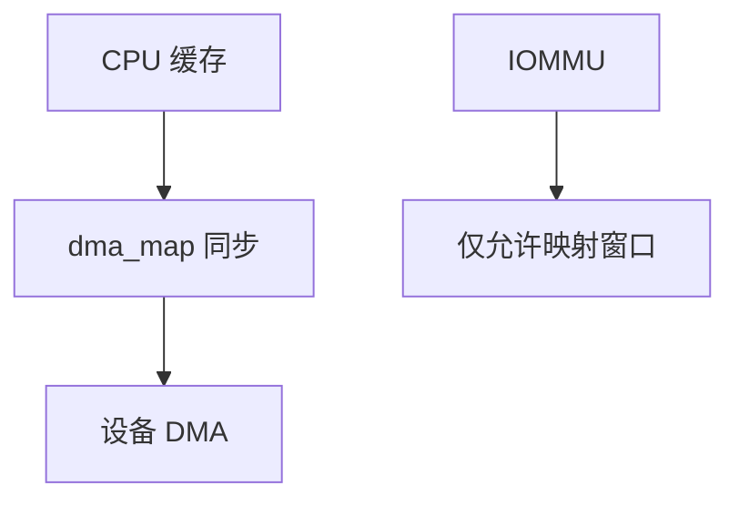

# DMA 一致性

设备 DMA 绕过 CPU 缓存：驱动必须 map/unmap 或用一致映射，否则 CPU 看见的是旧行，设备看见的是旧内存。

<footer>—— 据 Linux DMA-API 文档；PCI 与 IOMMU 对地址翻译的说明</footer>

[加固](/cs/kernel-hardening) 不管设备。[NVMe](/cs/nvme-driver)/[NIC](/cs/napi) 都靠 DMA。[直接映射](/cs/direct-map-highmem) 给 CPU 看 RAM。缺口是 **DMA API**：流式映射、一致缓冲、IOMMU 保护。

## 问题

缓存层次对设备不可见。流式：`dma_map_sg` 前 `cpu_to_dev` 刷或作废缓存，完成后 `dev_to_cpu`。一致：`dma_alloc_coherent` 非缓存或硬件嗅探。缺口：IOMMU 把设备地址限制在 map 的窗口，防乱 DMA；bounce buffer 给不能到达高物理地址的卡。本课不把每架构 cache line 维护指令写完。

VFIO 用户态 DMA 仍走 IOMMU 域。无 IOMMU 时设备信任基等于内核。

## 方法

驱动提交 I/O：map 页给设备，门铃，完成 interrupt 后 unmap。对照 [RDMA](/cs/rdma-os) MR：同类「允许 DMA 的窗口」。对照 [FUA](/cs/write-barrier-fua)：那是持久；这是缓存可见性。对照 KPTI：CPU 页表，不是 IOMMU 页表。

## 机制

DMA API 把「设备是另一个观察者」收成驱动义务，使块与网的完成含义正确。IOMMU 把义务加上隔离。不要写成 MESI 协议课全文。与 [热插拔](/cs/memory-hotplug)：offline 前必须无 DMA。

错误：漏 unmap 泄漏 IOMMU 表；过早 unmap 损坏。

实现上：流式映射的方向错了会静默损坏：TO_DEVICE 必须刷 CPU 缓存。IOMMU 组把无法隔离的设备绑在一起，VFIO 必须整组给同一用户。swiotlb 是 32 位 DMA 的 bounce。 读法上只引用[上一课](/cs/kernel-hardening)的结论，不把对象换成训练推理或限价簿。

本课在操作系统进阶的「内存进阶 / 回收、迁移与加固」课序里，对象是 **DMA 一致性**。

- 先修只引用，不重导：上一课的结论当公理，本课只补差。
- 五栏不吞并：不把本课写成大模型训练/推理，也不写成限价簿或权重量化。
- 文献用 OSTEP、McKusick、内核文档与具名会议论文；不发明 arXiv 编号。

## 边界

本课不引入 DMA-BUF 跨设备共享的全部。不保证所有 virtio 的 bounce。下一课 CPU 内存标签：MTE。

版本字段会变，课序钉的是机制对象「DMA 一致性」，不是某一主线内核的结构体名。
后课默认：DMA 必须经 map 与可选 IOMMU。用标签检测空间错误，下一课 MTE。

## 小结

- DMA 与 CPU 缓存要显式同步或一致映射。
- IOMMU 限制设备可写的物理窗口。
- 内存标签是下一课。
- 出处：Linux DMA-API；IOMMU；PCI。
