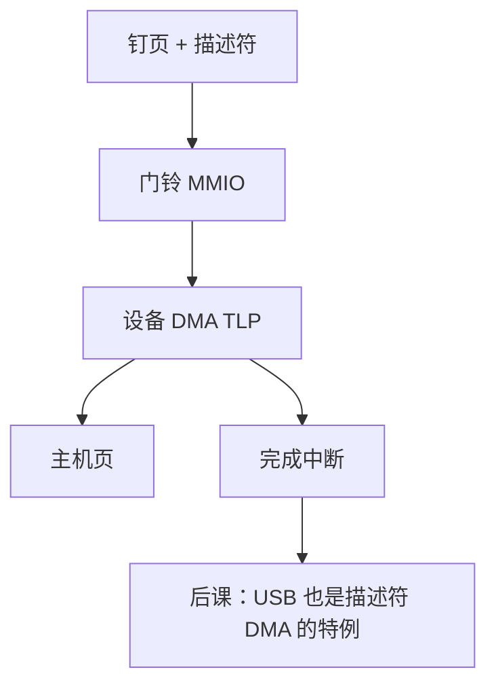

# DMA 控制器与散布聚集

  
设备当 PCIe 请求者自己发 Memory TLP，按描述符链表把不连续页搬成一次逻辑传输：CPU 不逐字拷，但要先把地址变成设备能懂的物理/IOVA。

  <footer>—— 据 PCI-SIG PCI Express Base Specification；Patterson and Hennessy, Computer Organization and Design (RISC-V)；Tanenbaum and Bos, Modern Operating Systems 整理</footer>

[上一课](/cs/timers-tsc-hpet)与数据搬运无关。[MMIO](/cs/bus-mmio) 点过设备当主设备。[PCIe 事务](/cs/pcie-tlp-bar)允许端点发 Memory 读写。缺口是 **DMA 与 scatter-gather**：描述符、IOMMU、以及与 [MSI](/cs/msi-msix) 的完成通知序。

## 问题

CPU `memcpy` 浪费缓存与核。DMA：软件在内存写描述符（源/目的/长度/下一项），门铃 BAR 踢设备，设备沿链表发 TLP。scatter-gather：用户缓冲跨很多物理页，描述符每页一项，设备串起来，不必拷成连续 bounce buffer（除非设备不能 SG 或不能 64 位地址）。缺口不是 TLP 类型，而是这条**描述符协议**与地址翻译。

IOMMU：设备看见 IOVA，硬件译成 PA，防止胡写。无 IOMMU 时驱动把 PA 直接填描述符，32 位设备需要 bounce。

### DMA 不是「更快的 load/store 指令」

CPU 的 load 走缓存一致性；DMA 写主机内存必须让 CPU 看见（窥探或 IOMMU 一致性属性）。把 DMA 当 `rep movs` 的微码，缓存与围栏会漏。完成：设备写回状态再发 MSI；CPU 处理函数必须读到描述符写回，依赖 PCIe 与内存序——后课 fence 再从 ISA 侧收。

Patterson/Hennessy 与 Tanenbaum 有 DMA 教学。PCIe 规范定义请求者。Linux `dma_map_sg` 是软件接口，本课钉硬件合同。

## 方法

准备：钉页、dma_map、填 SG 表。启动：写门铃。完成：MSI → 读状态、dma_unmap。错误：PCI AER、超时用[定时器](/cs/timers-tsc-hpet)。与 NVMe：提交队列在内存，门铃是 BAR 写，设备 DMA 读命令、DMA 写数据。

教学片上 DMA 控制器（ARM PL330 一类）是独立主设备，协议同形，总线可能是 AXI 而不是 PCIe。

## 机制

下一课 USB 把事务组织成更复杂的层次，但高速设备仍 DMA。显示帧缓冲常 DMA 扫描出。固件启动早期可能无 IOMMU，驱动用恒等映射。本课把「块与包如何进内存」钉在 PCIe 之后。

## 边界

本课不写全部 IOMMU 页表格式（后课 Sv39 是 CPU 侧；IOMMU 另规格）。不把 RDMA 网卡动词表抄来。不进入 GPU 显存 pinning 的全部 API。

后课默认：DMA 是设备发起的内存 TLP，SG 描述符描述非连续页；完成靠写回+MSI。

## 小结

- CPU 准备描述符与门铃；设备搬数据。
- scatter-gather 避免 bounce；IOMMU 翻译 IOVA。
- 可见性与中断序是正确性一部分。
- 出处：PCI-SIG；Patterson and Hennessy, COD；Tanenbaum and Bos。
