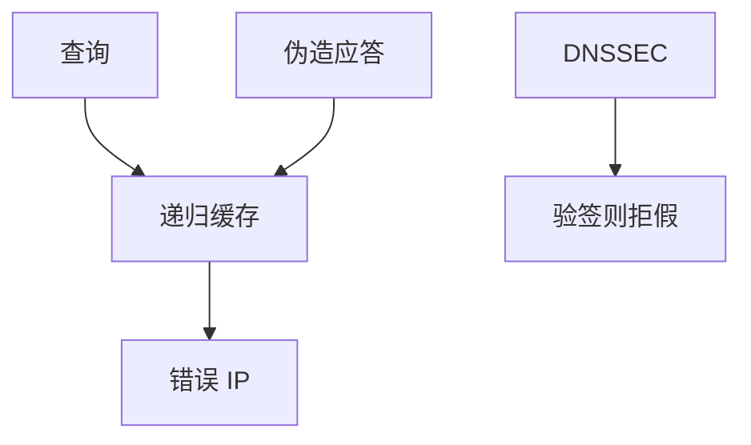

# DNS 缓存投毒

解析器若把错误的 A 记录缓存起来，随后的 TLS 会连到攻击者的 IP——证书验证仍可能失败，但用户会看到错误页或被诱去关校验。投毒打的是名称到地址的映射，不是 AES。

<footer>—— 据 Kaminsky 对缓存投毒的公开分析；RFC 5452；RFC 4033 DNSSEC</footer>

## 定位

上一课[WPA](/cs/wpa2-wpa3)保护最后一跳。缺口是**名字**：应用信任主机名，IP 来自 DNS。主干[DNS](/cs/dns)已有查询。本课收缓存污染与事务端口/ID 随机化，以及 DNSSEC 的真假。不给投毒操作程序。

后课默认已经读完本课钉下的合同，只补差，不从该领域第一性原理重开。

## 问题

递归解析器接受一条伪造应答并缓存，TTL 期内全网客户被指向错 IP。Kaminsky：扩大碰撞面。防御：源端口随机、DNSSEC 验签、DoT/DoH 对路径保密。缺口是解析信任，不是再讲记录类型。

### TLS 仍要验名

投毒后证书名不匹配应失败。用户点「继续」才把投毒兑现成保密失败。

RFC 5452 随机化。DNSSEC 验的是区签名链，部署不完整。本课禁止写伪造应答的实验指导。

## 方法

画查询 ID 与端口的匹配窗口。对照：路径加密（DoH）防窃听与部分篡改，但不自动给端到端区真实性——那是 DNSSEC。应用应钉证书或 DANE（点名即可）。

图中节点是本课的机制骨架；课程不把图展开成可运行的攻击步骤。

## 机制

身份链从证书回退到名字，名字回退到解析。下一课 ARP：同一局域网里更短的映射，IP 到 MAC。

前提写进合同之后，游戏外的误用只当失败模式点名，不在本课写成操作程序。

## 边界

本课不把全部 Kaminsky 变体写成菜谱。ARP 欺骗下一课：二层。

## 小结

- 无线之后，名字解析是下一跳信任。
- 缓存投毒污染 A/AAAA；TLS 名检查是安全带。
- 随机化、DNSSEC、加密传输分层补。
- 下一课 ARP 欺骗。
- 出处：RFC 5452；RFC 4033；Kaminsky（作为历史分析点名）。
