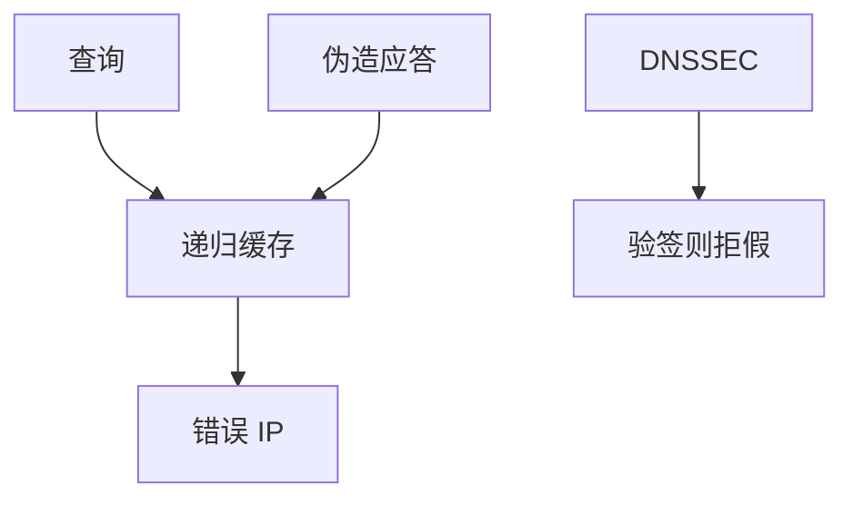
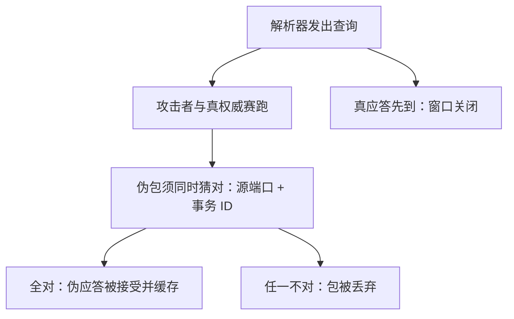

# DNS 缓存投毒

解析器若把错误的 A 记录缓存起来，随后的 TLS 会连到攻击者的 IP——证书验证仍可能失败，但用户会看到错误页或被诱去关校验。投毒打的是名称到地址的映射，不是 AES。

<footer>—— 据 Kaminsky 对缓存投毒的公开分析；RFC 5452；RFC 4033 DNSSEC</footer>

上一课[WPA](/cs/wpa2-wpa3)保护最后一跳。缺口是**名字**：应用信任主机名，IP 来自 DNS。主干[DNS](/cs/dns)已有查询。本课收缓存污染与事务端口/ID 随机化，以及 DNSSEC 的真假。不给投毒操作程序。

后课默认已经读完本课钉下的合同，只补差，不从该领域第一性原理重开。

## 问题

递归解析器接受一条伪造应答并缓存，TTL 期内全网客户被指向错 IP。Kaminsky：扩大碰撞面。防御：源端口随机、DNSSEC 验签、DoT/DoH 对路径保密。缺口是解析信任，不是再讲记录类型。

数字实例：传统应答只有 16 位事务 ID，约 6.5 万种可能；Kaminsky 式攻击用大量查询放大碰撞机会。防御把源端口也随机化（16 位）后，组合涨到约 40 亿种，命中从「试几次」变成「基本试不中」。

### TLS 仍要验名

投毒后证书名不匹配应失败。用户点「继续」才把投毒兑现成保密失败。

RFC 5452 随机化。DNSSEC 验的是区签名链，部署不完整。本课禁止写伪造应答的实验指导。

## 方法

画查询 ID 与端口的匹配窗口。对照：路径加密（DoH）防窃听与部分篡改，但不自动给端到端区真实性——那是 DNSSEC。应用应钉证书或 DANE（点名即可）。

常见误区：以为上了 DoH/DoT 就万事大吉。它们只是把「你问了什么」装进加密信封，防路上偷看与半路篡改；记录本身是真是假，仍要 DNSSEC 的签名链说话。加密管道里送来的也可能是伪造数据。

```mermaid
flowchart TD
  Q["查询"] --> CACHE["递归缓存"]
  FAKE["伪造应答"] --> CACHE
  CACHE --> IP["错误 IP"]
  DNSSEC["DNSSEC"] --> V["验签则拒假"]
```

## 机制

身份链从证书回退到名字，名字回退到解析。下一课 ARP：同一局域网里更短的映射，IP 到 MAC。

```mermaid
flowchart TD
  Q["解析器发出查询"] --> RACE["攻击者与真权威赛跑"]
  RACE --> GUESS["伪包须同时猜对：源端口 + 事务 ID"]
  GUESS --> HIT["全对：伪应答被接受并缓存"]
  GUESS --> MISS["任一不对：包被丢弃"]
  Q --> REAL["真应答先到：窗口关闭"]
```

为什么重要：TLS 证书校验是投毒得手后的最后一道安全带——名字对不上就断开。可现实中用户见到警告常点「继续访问」，安全带等于自己解开；所以现代浏览器对证书错误默认不给「继续」按钮，正是为这类场景兜底。

## 边界

本课不把全部 Kaminsky 变体写成菜谱。ARP 欺骗下一课：二层。

## 小结

- 无线之后，名字解析是下一跳信任。
- 缓存投毒污染 A/AAAA；TLS 名检查是安全带。
- 随机化、DNSSEC、加密传输分层补。
- 下一课 ARP 欺骗。
- 出处：RFC 5452；RFC 4033；Kaminsky（作为历史分析点名）。
