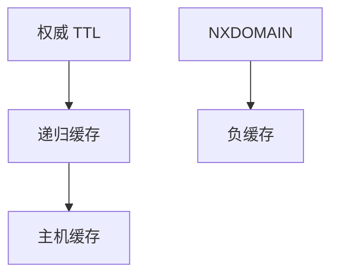

# DNS 缓存与 TTL

每条记录带着 TTL，解析器与主机按它缓存；TTL 是延迟与一致性的旋钮，不是密码学保证。

<footer>—— 据 RFC 1034 / 1035；RFC 2308 否定缓存；Kurose and Ross DNS 节整理</footer>

主干[DNS](/cs/dns)、[递归](/cs/dns-recursive)、[记录](/cs/dns-rr) 已给查询链。[上一课](/cs/serialization-protobuf) 结束 Web 协议。缺口是**缓存时间**：正缓存、负缓存、过短打根、过长难切换。本课不把 DNSSEC 写完。

## 问题

每次 URL 都跑迭代会把根打爆，也把 RTT 加进网页。TTL：权威说这份 A 记录能记多久。CDN 用短 TTL 做故障切换；长 TTL 抗 DDoS、减延迟。负缓存（NXDOMAIN）防止缓存穿透。TTL=0 几乎禁用缓存。与 HTTP Cache-Control 同类旋钮，名字空间不同。任播根不靠 TTL 切流量。

不要把 TTL 写成证书有效期。

RFC 2308。最小 TTL 与 TTL 上限是解析器政策。本课不把每种 RR 的 TTL 策略写完。

### TTL 不是证书期

正负缓存都遵它。短则灵活费查询，长则切得慢。公共解析器让 Geo 变钝。TTL=1s 会打爆权威。

## 方法

画：权威 → 递归缓存 → stub。对照 BGP 收敛：DNS 切换受 TTL 下界约束，常比 BGP 慢或快取决于值。测：看应答里的剩余 TTL。

方法止于选定对象与对照；机制才说它如何嵌入已有分层与主干课。

## 机制

Cookie 会话不替代 DNS 缓存。GeoDNS 下一课用同一 TTL 机制发不同答案。H3 的 HTTPS RR 也有 TTL。过期后要重新查询，无线贵。劫持缓存（没有 DNSSEC）是安全课对象。

负载均衡用短 TTL 轮询多 A 记录，与 ECMP 不同：在解析器，不在包哈希。

## 边界

本课不引入 prefetch 的全部。DNSSEC 是下一课。后课默认：TTL 管 DNS 缓存寿命；切换速度不快于 TTL。

把所有记录 TTL 设 1 秒会把解析器变成权威的 DDoS 放大器。

上一课留下的缺口在本课收口；「DNS 缓存与 TTL」进入后课词汇表后只引用。文献用来钉对象与边界，不把本课写成该主题的独立综述。下一课[DNSSEC](/cs/dnssec)。

## 小结

- 正/负缓存都遵 TTL。
- 短 TTL 灵活、费查询；长 TTL 稳、切得慢。
- 与 HTTP 缓存同构不同层。
- 后课只引用本课钉死的对象，不从该领域总问题重开。
- 出处：RFC 1034/1035；RFC 2308。
