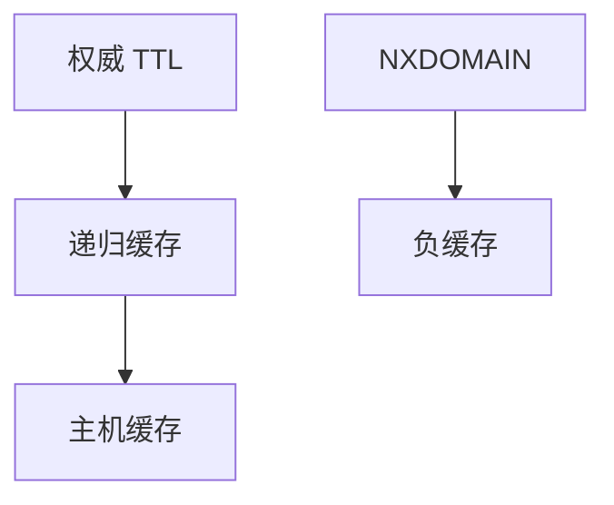
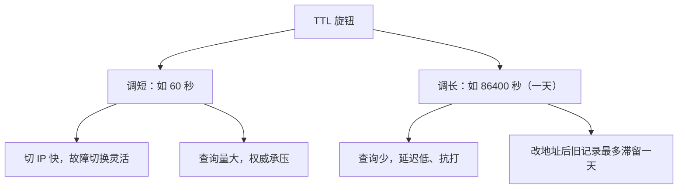

# DNS 缓存与 TTL

每条记录带着 TTL，解析器与主机按它缓存；TTL 是延迟与一致性的旋钮，不是密码学保证。

<footer>—— 据 RFC 1034 / 1035；RFC 2308 否定缓存；Kurose and Ross DNS 节整理</footer>

主干[DNS](/cs/dns)、[递归](/cs/dns-recursive)、[记录](/cs/dns-rr) 已给查询链。[上一课](/cs/serialization-protobuf) 结束 Web 协议。缺口是**缓存时间**：正缓存、负缓存、过短打根、过长难切换。本课不把 DNSSEC 写完。

## 问题

每次 URL 都跑迭代会把根打爆，也把 RTT 加进网页。TTL：权威说这份 A 记录能记多久。CDN 用短 TTL 做故障切换；长 TTL 抗 DDoS、减延迟。负缓存（NXDOMAIN）防止缓存穿透。TTL=0 几乎禁用缓存。与 HTTP Cache-Control 同类旋钮，名字空间不同。任播根不靠 TTL 切流量。

术语翻译：TTL（Time To Live）就是记录的保质期，单位秒，由权威服务器随应答下发。解析器存记录时记下剩余时间，有人来问就递减着报；减到 0 就丢弃、重新去问权威。

不要把 TTL 写成证书有效期。

RFC 2308。最小 TTL 与 TTL 上限是解析器政策。本课不把每种 RR 的 TTL 策略写完。

### TTL 不是证书期

正负缓存都遵它。短则灵活费查询，长则切得慢。公共解析器让 Geo 变钝。TTL=1s 会打爆权威。

## 方法

画：权威 → 递归缓存 → stub。对照 BGP 收敛：DNS 切换受 TTL 下界约束，常比 BGP 慢或快取决于值。测：看应答里的剩余 TTL。

数字实例：要把网站迁到新 IP，TTL 设 3600 就意味着最长一小时内仍有用户连旧机器。运维惯例是提前 24 小时把 TTL 降到 300，等全网缓存都换上短命记录后再改 A 记录，几分钟完成切换，事后再调回去。

```mermaid
flowchart TD
  AUTH["权威 TTL"] --> REC["递归缓存"]
  REC --> STUB["主机缓存"]
  NEG["NXDOMAIN"] --> NC["负缓存"]
```

## 机制

Cookie 会话不替代 DNS 缓存。GeoDNS 下一课用同一 TTL 机制发不同答案。H3 的 HTTPS RR 也有 TTL。过期后要重新查询，无线贵。劫持缓存（没有 DNSSEC）是安全课对象。

负载均衡用短 TTL 轮询多 A 记录，与 ECMP 不同：在解析器，不在包哈希。

```mermaid
flowchart TD
  K["TTL 旋钮"] --> S["调短：如 60 秒"]
  S --> S1["切 IP 快，故障切换灵活"]
  S --> S2["查询量大，权威承压"]
  K --> L["调长：如 86400 秒（一天）"]
  L --> L1["查询少，延迟低、抗打"]
  L --> L2["改地址后旧记录最多滞留一天"]
```

常见误区：新配的域名立刻收不到邮件，往往不是配置写错，而是之前查到的 NXDOMAIN 被负缓存了——「这个名字不存在」本身也是一条带 TTL 的记录。改完配置要等负缓存过期，或清掉本地缓存再验证。

## 边界

本课不引入 prefetch 的全部。DNSSEC 是下一课。后课默认：TTL 管 DNS 缓存寿命；切换速度不快于 TTL。

把所有记录 TTL 设 1 秒会把解析器变成权威的 DDoS 放大器。

下一课[DNSSEC](/cs/dnssec)。

## 小结

- 正/负缓存都遵 TTL。
- 短 TTL 灵活、费查询；长 TTL 稳、切得慢。
- 与 HTTP 缓存同构不同层。
- 后课只引用本课钉死的对象，不从该领域总问题重开。
- 出处：RFC 1034/1035；RFC 2308。
