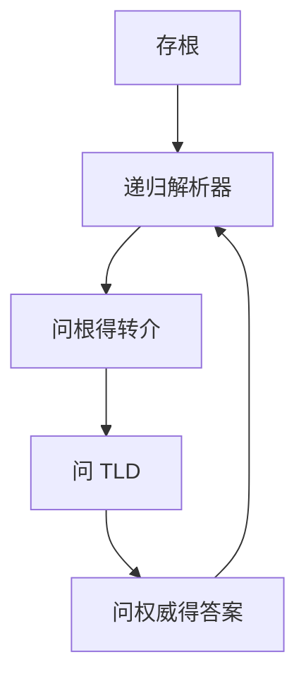

# 递归与迭代

存根解析器只问一台递归服务器；递归服务器替它走完从根到权威的迭代，并把答案缓存。

<footer>—— 据 Mockapetris, RFC 1034；Kurose and Ross 对解析模式的整理</footer>

[上一课](/cs/dns)给出层次名字与「从根到权威」。本课不重画区的树。缺口是谁去问：主机上的存根几乎总把完整问题交给递归解析器；递归解析器对根、TLD、权威做**迭代**查询（答「去问那边」），直到得到答案或失败。本课不把记录类型表写完。

## 问题

[DNS](/cs/dns) 留下解析步骤。若每台笔记本自己从根迭代，根流量与延迟都不可接受，缓存也无法共享。[DHCP](/cs/dhcp-nat) 交出的正是递归服务器地址。递归：对客户负责完整答案；迭代：服务器之间用转介把问题推向下一级。缺口是**两种查询角色**，不是 HTTP。

缓存带 TTL。权威才是该区的真相；递归缓存过期后必须再走迭代。DNSSEC 是认证，后课安全再谈，本课只钉解析路径。

## 方法

存根 → 递归（递归标志）。递归若缓存命中则直接答；否则从根提示开始：问，得 NS 转介，再问，直到权威的应答。迭代服务器不替对方追问。失败：名字不存在、超时、截断改 TCP，本课不把全部 RCODE 背完。

## 机制

递归把「层次查找」收成对应用透明的一次往返（加上缓存）。它与 [LPM](/cs/lpm) 不同：DNS 是应用层名字，IP 前缀是定位。端到端：解析错误会把 TCP 连到错误地址，TLS 证书名检查是后课补的真实性，本课只得到「一套记录」。

## 边界

本课不把 DoH/DoT 当主干必选，不引入根密钥典礼。答案里到底是地址还是别的对象，下一课资源记录类型。

后课默认：存根依赖递归；递归走迭代并缓存。记录类型决定答案含义。

## 小结

- 递归对客户负责；服务器之间迭代转介。
- 缓存按 TTL，真相在权威。
- 记录类型下一课。
- 出处：RFC 1034；Kurose and Ross。
