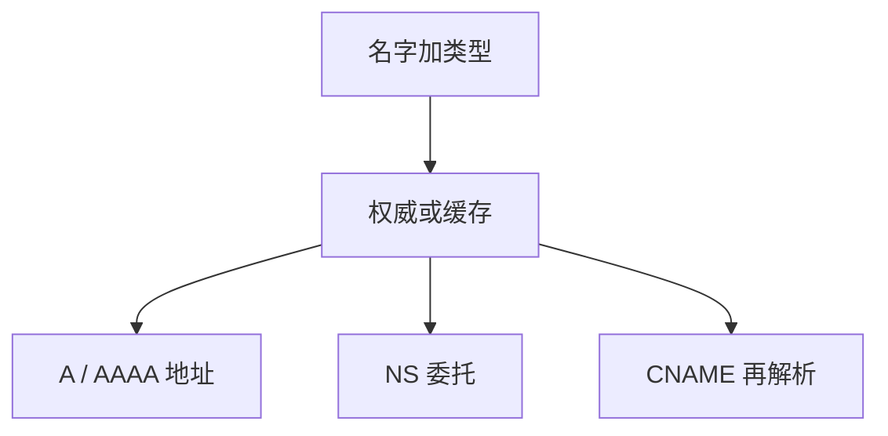

# DNS 记录类型

同一名字下可以挂地址、别名、邮件交换、名字服务器；类型决定答案是什么对象，而不只是「有没有这个名字」。

<footer>—— 据 RFC 1035 的 RR 格式；Kurose and Ross 对常用记录的整理</footer>

[上一课](/cs/dns-recursive)走完递归与迭代。本课不重画根到权威。缺口是应答里的资源记录（RR）：A/AAAA 是地址，NS 是下一层权威，CNAME 是别名，MX 是邮件，TXT 是文本约定。解析器按**问的类型**取子集。本课不把 HTTP 方法提前。

## 问题

[DNS](/cs/dns) 说「得到地址或其他记录」。若只有 A，[IPv6](/cs/ipv6-contrast) 的双栈无法表达；若 CNAME 与 NS 在区顶混用，委托会坏。每条 RR 有所有者、类型、类、TTL、数据。缺口是**类型作为模式**，让后课 CDN 用同一名字返回不同地址成为合法，而不是协议外魔法。

CNAME 的目标要再查。别名链有深度限制。SOA 描述区的权威参数，不是给浏览器打开网页用的。

## 方法

查询：名字 + 类型。权威返回匹配 RR，以及胶水（NS 的 A/AAAA）以便解析器继续。否定缓存（NSEC 等属 DNSSEC 一线）本课只承认「不存在也要记一会儿」。应用选类型：浏览器要 A/AAAA，邮件要 MX。

## 机制

RR 把层次名字从「一台主机」扩成「一组类型化属性」。[任播与 CDN](/cs/cdn-intuition) 后课会改 A/AAAA 的值或 NS 指向，类型系统不变。校验：UDP DNS 有长度与截断；真实性不是 RR 自带的，后课 TLS 用证书绑名字。

## 边界

本课不把全部类型注册表写进主干，不引入 SVCB/HTTPS 的全部键。对资源做 GET 的应用协议下一课 HTTP。

后课默认：解析结果是带类型的记录集。网页与 API 的方法与状态码是另一层。

## 小结

- RR 以类型区分地址、委托、别名等。
- 查询必须带类型；CNAME 触发后续查找。
- 应用层 HTTP 下一课。
- 出处：RFC 1034/1035；Kurose and Ross。
