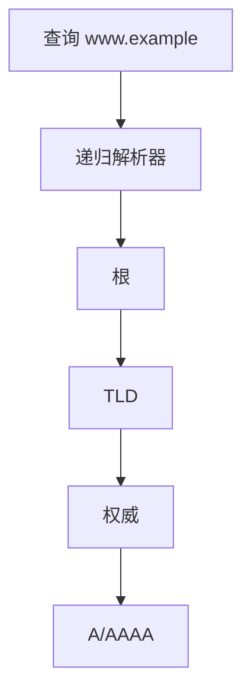

# DNS

域名是层次化的名字；解析器从根到权威逐级询问，得到地址或其他记录。

<footer>—— 据 Mockapetris, RFC 1034, Domain Names — Concepts and Facilities, 1987 整理</footer>

[上一课](/cs/quic-contrast)与 TCP 都假定目的是 IP。[DHCP](/cs/quic-contrast) 交出的「DNS 服务器」还没有被使用。人不能记前缀表。缺口是 **DNS**：层次名字到记录（A/AAAA 等）。本课不把 HTTP 方法写完。

## 问题

若每台主机持有全球静态表，无法更新。RFC 1034：树状名字空间，每区有权威服务器；递归解析器代客户端走路：问根要 TLD，问 TLD 要权威，问权威要记录。常用 [UDP](/cs/udp) 53，大包或区传送走 TCP。缺口不是 BGP 如何通告前缀，而是应用看见的名字。

本课不把 DNSSEC 验证链写完。

缓存按 TTL。CNAME、MX、NS 是其他记录类型。本课主干是「名字 → 地址」，为 HTTP 打开连接做准备。

## 方法

应用调用解析器库（后课套接字之前）。存根问本地递归；递归从根（或缓存）迭代。应答含答案或转介。与 [ARP](/cs/arp) 对照：ARP 是一跳、广播；DNS 是应用层、全球层次、可缓存。

## 机制

DNS 让 [IP 编址](/cs/ip-subnet) 对人隐藏，让服务可以改地址而不改名字（在 TTL 内）。端到端：解析错误会连错主机，TLS 课才用证书把名字钉到密钥；本课 DNS 本身可被污染，点名即可。Anycast 根与 CDN 的联合在再后一课。

查询走 UDP，丢失靠解析器重试，不用 TCP 可靠流，符合「短请求」的端到端选择。

## 边界

本课不引入 DoH/DoT 的全部部署。不把 mDNS 局域网发现当全球 DNS。也不把 ENUM 电话映射写进主干。得到地址之后，应用层如何取文档，下一课 HTTP。

根与 TLD 的响应是转介不是最终答案；若把转介当 A 记录，客户端会连错。存根解析器不应自己从根走完全程，除非它就是递归器。

后课默认：主机名可解析为 IP。文档的方法、头、状态码，下一课 HTTP。

## 小结

- DNS（RFC 1034）层次解析名字到记录，UDP 为主。
- 缓存 TTL；与 ARP 不在同一层。
- 取超文本是 HTTP 的缺口。
- 出处：RFC 1034；RFC 1035；Kurose and Ross。
