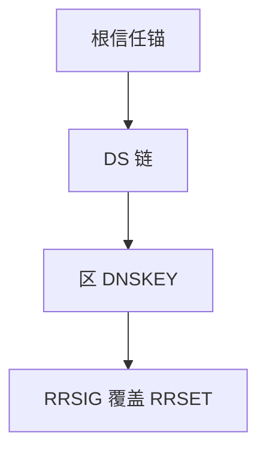

# DNSSEC

权威用私钥签 RRSET，解析器沿 DS 链到根信任锚验证；防篡改与伪造，不加密查询。

<footer>—— 据 RFC 4033 / 4034 / 4035 DNSSEC 整理</footer>

[上一课](/cs/dns-cache-ttl) 的缓存可被毒化。主干 DNS 无认证。[RPKI](/cs/bgp-hijack-rpki) 是路由侧同类问题。缺口是 **DNSSEC**：RRSIG、DNSKEY、DS、AD 位。本课不把 DoH 写完。

## 问题

UDP 查询易被伪造应答（缓存中毒）。DNSSEC：区签名，父区 DS 钉子区密钥，直到根。验证失败应 SERVFAIL，不能「软失败当没开」。NSEC/NSEC3 证明不存在。不提供机密：嗅探仍可见问了谁——下一课 DoH/DoT。与 RPKI 对照：都是 PKI 钉源，验证的对象是 DNS 节点 vs 前缀。

不要把 DNSSEC 写成让域名变安全浏览的全部。

RFC 4033–4035。密钥轮换与算法是运营。本课不写攻击步骤。

### 完整性不是机密

链到根锚，失败应硬失败。不加密 QNAME。密钥轮换要时钟大致对。报文变大易截断。

## 方法

画：根锚 → TLD DS → 区 DNSKEY → RRSIG。对照 TLS：TLS 保护信道，DNSSEC 保护 DNS 数据。Cookie 无补。

方法止于选定对象与对照；机制才说它如何嵌入已有分层与主干课。

## 机制

报文变大，易截断改 TCP，与 PMTUD 互动。TTL 内签名必须有效，时钟要大致对——后课 NTP。解析器 CPU 验签，放大攻击要限。CDN 多权威要共享或分签。

AD 位仅当解析器已验；应用若自己验更端到端。

## 边界

本课不引入 DANE 的全部。DoH/DoT 是下一课。后课默认：DNSSEC 完整性与真实性；非机密。

部署断裂（父 DS 不配）比不开更伤，表现为解析失败。

上一课留下的缺口在本课收口；「DNSSEC」进入后课词汇表后只引用。文献用来钉对象与边界，不把本课写成该主题的独立综述。下一课[DoH / DoT](/cs/doh-dot)。

## 小结

- 签名链到根锚，防伪造应答。
- 不加密查询内容。
- 失败应硬失败，勿降级。
- 后课只引用本课钉死的对象，不从该领域总问题重开。
- 出处：RFC 4033–4035。
