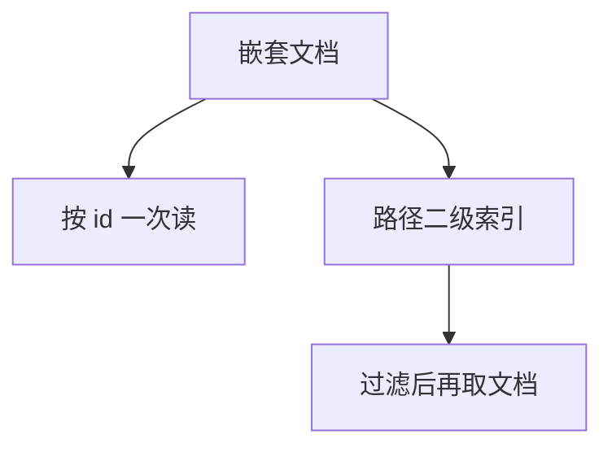

# 文档数据库

文档是嵌套的自描述记录，默认一次读整图。二级索引与聚合管道补查询；跨文档事务曾是弱项，现正在往回补 SQL 课已有的东西。

<footer>—— 据 Stonebraker 对文档；MongoDB 文档模型实践；阻抗失配对照</footer>

[上一课](/cs/rocksdb)给了 KV LSM。本课把值变成 JSON/BSON 一类文档。缺口是数据模型：1NF 分解 vs 嵌套预连接。ORM 阻抗课的对象图在这里接近存储形状。不是「无 schema」——有 schema 演化与稀疏字段，约束弱于关系。

## 问题

嵌套数组：订单内行项目一次读出，免连接。更新一行项目可能重写整文档或用路径更新。缺口是**粒度**：文档太大则回表式读放大，太碎则又变关系。二级索引：对嵌套路径建 B+ 或 LSM 索引，写放大按路径。聚合：管道像受限的物理计划，优化器弱于 Selinger 全搜索。

事务：早期单文档原子；多文档事务回到 2PL/MVCC 故事。分片键常是文档 id 或租户。

文档库不是向量库、不是图库。查询语言不是 SQL 全集。本课模型，不背某查询语法。

## 方法

建模：按读路径嵌套，按写冲突切文档。索引只盖过滤路径。与 CDC：oplog 是逻辑日志。与 Parquet：分析常倒出列文件，HTAP 新鲜度问题再现。

NULL 与缺字段：稀疏，与三值不同，查询要定义缺省。

## 机制

存储常 LSM（WiredTiger、RocksDB）。覆盖：投影可只返回字段，延迟物化在文档内。计划回归：忘了索引变成全集合扫。

关系对照：连接存在但贵，鼓励反规范化——5NF 课的显式冗余，缺维护合同则漂移。

## 边界

本课不讲 Bigtable 宽列。也不把文档当全文引擎——全文另倒排。图多跳文档嵌套表达差。

后课默认：读路径聚合用文档；多对多连接用关系或图。宽列 Bigtable：稀疏列族、行键设计，不是 JSON 树。

文档是预物化的外模式，内模式仍是页或 SST。

## 小结

- 文档嵌套服务一次读出；索引与多文档事务补关系能力。
- 过大过碎都失败；分析常外倒列存。
- 宽列 Bigtable 下一课。
- 出处：Stonebraker；文档库实践；阻抗课。
