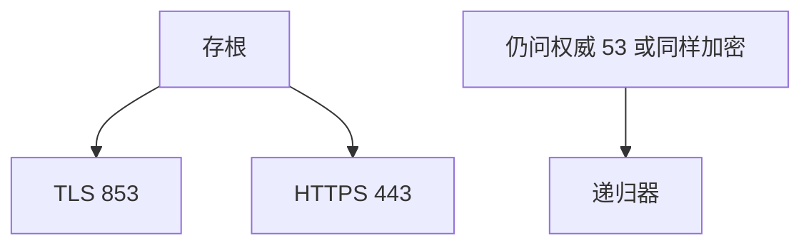

# DoH / DoT

DoT 在 TLS 上跑 DNS 报文，DoH 把查询放进 HTTPS；机密对路径上的观察者隐藏 QNAME，把信任挪到解析器运营方。

<footer>—— 据 RFC 7858 DoT；RFC 8484 DoH 整理</footer>

[DNSSEC](/cs/dnssec) 不加密。[TLS 入口](/cs/http-tls-entry) 已有信道。[上一课](/cs/dnssec) 留下嗅探。缺口是 **DoT/DoH**：端口 853 vs 443、与企业过滤的张力。本课不把 GeoDNS 写完。

## 问题

咖啡馆 Wi‑Fi 看见你查询。DoT：TCP/TLS 853。DoH：GET/POST `application/dns-message`，混在 Web 流量里。客户端要钉解析器证书（或系统配置），否则只是换中间人。DNSSEC 仍可在隧道里验数据。与 QUIC：DoQ 点名。Cookie 与 DoH 共享 HTTPS 栈，缓存层次不同。

不要把 DoH 写成 DNSSEC 的替代。

RFC 8484。Split DNS 企业场景会冲突。本课不站队政策。

### 机密化 stub–递归

信任挪到解析器运营方。DNSSEC 仍验数据。企业过滤与 443 混叠是政策张力。不是 DNSSEC 替代。

## 方法

对照：53 明文 / DoT / DoH。画：stub → TLS → 解析器。与 Happy Eyeballs 同类：发现与回退。

方法止于选定对象与对照；机制才说它如何嵌入已有分层与主干课。

## 机制

递归器到权威仍常明文，观察点上移到大型解析器。TTL 缓存仍在递归器。H3 可载 DoH。中间企业防火墙看见 443 无法按域过滤 DNS，这是设计后果。RTT：多一次 TLS，连接复用摊销，像 HTTP 持久。

SYN 泛洪变成 HTTPS 泛洪，对象换层。

## 边界

本课不引入 Oblivious DoH 的全部。GeoDNS 是下一课。后课默认：DoT/DoH 机密化 stub–递归；信任解析器。

把所有设备钉同一公共 DoH，等于把元数据集中。

上一课留下的缺口在本课收口；「DoH / DoT」进入后课词汇表后只引用。文献用来钉对象与边界，不把本课写成该主题的独立综述。下一课[GeoDNS](/cs/geodns)。

## 小结

- DoT/DoH 加密查询路径。
- DNSSEC 仍验数据。
- 信任与可见性从路径挪到解析器。
- 后课只引用本课钉死的对象，不从该领域总问题重开。
- 出处：RFC 7858；RFC 8484。
