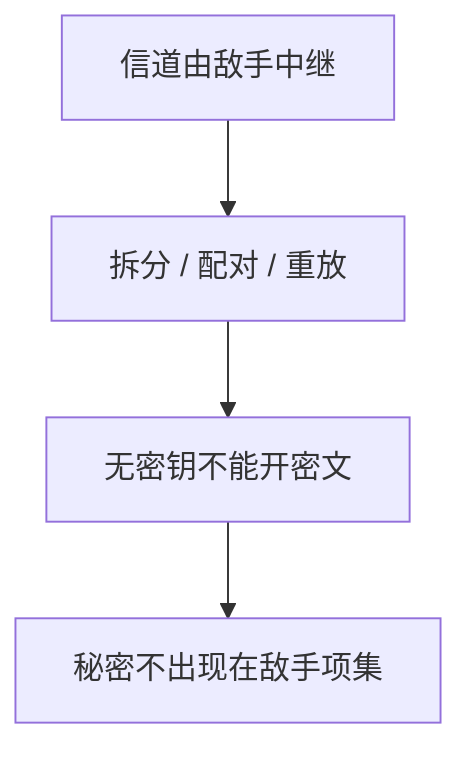

# Dolev–Yao

网络敌手可以拆、拼、重放它看见的项，但不能从密文算出明文，除非它有密钥——协议在这个代数里证明安全或不安全。

<footer>—— Dolev and Yao, On the Security of Public Key Protocols, IEEE TIT 1983；Anderson 对协议假设的整理</footer>

[上一课](/cs/stride)用清单问数据流图。本课不重列六类。缺口是协议课的敌手：不是「黑客」口号，而是形式化能力。Dolev–Yao：控制信道，任意组合已知消息，密码原语当黑盒。后课对称加密在此模型里才有「够用的那一层」。

## 问题

STRIDE 的「篡改/伪造」在网上太宽。Needham–Schroeder 一类协议要问：在能改包的敌手下，认证还是否成立。Dolev–Yao 把加密当成理想锁：没有钥匙打不开，有钥匙可以构造新项。缺口是**协议分析的默认敌手**，不是某一分组算法。

计算模型（概率多项式时间）更细，后课只在需要时点名。侧信道不在 DY 里，后课瞬态执行再扩展模型。

## 方法

消息是项：原子、对、加密。敌手封闭于投影、配对、用已知键加解密、重放。协议是角色进程。安全目标写成「敌手项集里不出现某秘密」或「会话绑定到声称身份」。本课不跑具体攻击轨迹。

## 机制

把敌手钉成代数，后课 TLS、Kerberos 才能说「防的是 DY 主动者，不防已泄露的私钥」。Kerckhoffs 已在威胁模型课：算法公开。DY 再加：算法理想。真实分组模式若误用，会漏出 DY 假定锁不住的性质——下一单元对称加密与模式。

## 边界

本课不把模型检测工具当必会软件。共享密钥下明文如何藏进密文，下一课对称加密。

后课默认：协议敌手是 DY 主动者。对称密码服务「无密钥则不可读」。

## 小结

- Dolev–Yao：控制网络，密码当理想锁。
- 不覆盖侧信道与弱随机数。
- 对称加密下一课。
- 出处：Dolev and Yao, *IEEE TIT* 1983；Anderson。
