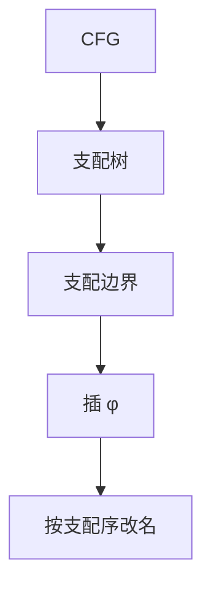

# 支配与 φ

$d$ 支配 $n$ 当每条从入口到 $n$ 的路都经过 $d$；支配边界是插入 φ 的位置，使汇合处每个名字仍只赋值一次。

<footer>—— 据 Lengauer and Tarjan, A Fast Algorithm for Finding Dominators in a Flowgraph, 1979；Cytron et al., 1991 整理</footer>

上一课[SSA](/cs/ssa-form)已经声明：改名、φ 按支配边界放置，Cytron 高效，本课要直觉。SSA 课把 φ 当语义，支配一笔带过。本课不重写「一次赋值一名」。缺口是支配树与支配边界 $\mathrm{DF}$：为何 φ 插在那里就不多不少。后课活跃变量在这张已改名的图上算区间。

## 问题

入口 $s$ 支配所有可达块。严格支配：排除自身。直接支配 $\mathrm{idom}(n)$ 是严格支配 $n$ 的最「近」者，全体 $\mathrm{idom}$ 成树。支配边界：被 $n$ 支配的块的后继里，那些**不再**被 $n$ 严格支配的块——恰是「有的前驱带着 $n$ 的定值、有的没有」的入口。对变量 $x$ 的每个定值块，在 $\mathrm{DF}$ 插 $\phi$，再迭代（φ 自己也是定值）。

缺口是这一定义，不是再解释 φ 要在后端拆掉。Lengauer–Tarjan 用 DFS 半支配在几乎线性时间算 $\mathrm{idom}$；本课认算法名，不证。

### 支配不是后支配

后支配是到出口的对偶，用于部分死代码、控制依赖。φ 放置用正向支配。不要把「必经出口」当 DF。

Lengauer–Tarjan 1979。Cytron et al. 1991 把 DF 与 SSA 连起来。Appel 1998 把 SSA 比作函数式。SSA 课已引二者；本课把树与边界写清，供数据流课默认「标量名已唯一」。

## 方法

算支配树（迭代交或 LT）。对每个变量的定值集求 DF 并插 φ。按支配序重命名栈：进入块 push 新名，离开 pop。φ 的第 $i$ 个操作数来自第 $i$ 个前驱的当前名。

不可约 CFG 仍有支配树；DF 可能更肥，φ 更多，不要求先可约。

## 机制

剪枝 SSA：若定值从不在支配范围内被读，可不插。半剪枝用全局活跃，完整剪枝更贵。本课默认至少半剪枝直觉。φ 不是 ISA 指令：后课分配前在前驱末插 `move`。

与[DFS 边分类](/cs/dfs-edge-types)：支配算法用 DFS 树；回边与支配关系相关但不是同一分类。

## 边界

本课不算 `in/out` 活跃方程。不做 memory SSA。后课默认：标量已是 SSA，汇合点有 φ。数据流框架以活跃变量为代表下一课补——冲突图要的是同时活，不是支配。

## 小结

- 支配树给出 idom；DF 决定 φ 的位置。
- 改名沿支配序；φ 后端再拆。
- 活跃区间仍是下一课的对象。
- 出处：Lengauer and Tarjan, 1979；Cytron et al., 1991。
