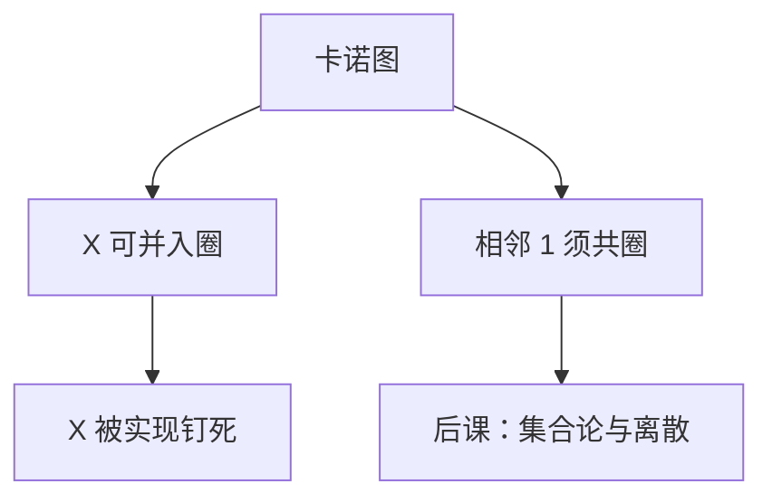

# 不完全指定与险象

有些输入组合永远不会出现，那些格子可以当 0 也可以当 1；化简可以借它们，却不能假装输入是静止的。

<footer>—— 据 Harris and Harris, Digital Design and Computer Architecture；Unger 对组合险象的经典处理整理</footer>

上一课[Quine–McCluskey](/cs/quine-mccluskey)钉死了完全指定函数的两级合并。本课不重画格雷码网格，也不从「时序电路」另起。缺口有两处，都是卡诺图假装没看见的：有些输入**不会发生**；输入**会变**，中间可能闪一下。

## 问题

译码器、指令操作码、后课 FSM 的现态，常常只使用 $2^n$ 中的一部分。那些行在真值表里是 $X$。若强制填 0，圈变小；把 $X$ 收进圈，乘积项可以更大。缺口之一是：化简必须声明哪些是无关项，合并后这些输入上的值被实现钉死，不能再当「任意」。

第二缺口：两级与或在输入单比特变化时，若两个相邻 1 分属两个圈且无覆盖两者的圈，输出可能短暂变 0——**静态 1-险象**。卡诺图的最小覆盖可以合法地留下这种洞。功能的静态真值表看不出毛刺。

### 无关项不是「别关心对错」

$X$ 只在「不会作为输入出现」时才无关。一旦被圈进去，硬件在那一点有确定值；若将来编码改了、那个组合出现了，行为已经定了。把 $X$ 当成仿真里的不定态传播，是另一套语义，本课不混用。

Harris 用 $d$ 或 $X$ 填图，并说明用质蕴涵项盖住相邻 1 可消静态险象。本课不把动态险象、本质险象的充分条件写完，那些要等多级延迟模型。

## 方法

卡诺图上 $X$ 可圈可不圈，选能扩大 2 的幂圈的那些。覆盖完成后，每个 $X$ 变成 0 或 1。对静态 1-险象：凡是差一位的两个 1，应有一个圈同时盖住它们。这可能牺牲「项数最少」。

## 机制

后课指令译码会把未使用操作码标成 $X$，综合成更少门；若 CPU 必须对非法操作码陷阱，那些行就不是 $X$，而是确定的异常路径——[异常入口](/cs/exception-interrupt-entry)才接。险象在组合输出直接进时钟敏感点时有害；若输出只在时钟沿被采样，毛刺可能被忽略——那要等[建立保持时间](/cs/setup-hold)。本课只承认组合层会闪。

## 边界

本课不引入触发器，不分析多输入同时变的动态险象充分条件，不把模拟电压的中间层当成第三逻辑值。信息与离散课序到此，电路实现尚未开始；下一课改用集合语言，为图、计数、归纳铺底，不再化简门。

后课默认：不完全指定用于化简；一旦实现，$X$ 消失。静态险象用冗余覆盖消除，若需要。

## 小结

- $X$ 可帮助合并，实现后不再任意。
- 最小 SOP 可能留下静态险象；相邻 1 共圈可消。
- 毛刺是否有害，取决于后课是否在时钟沿采样。
- 出处：Harris and Harris；组合险象的经典电路教材处理。
