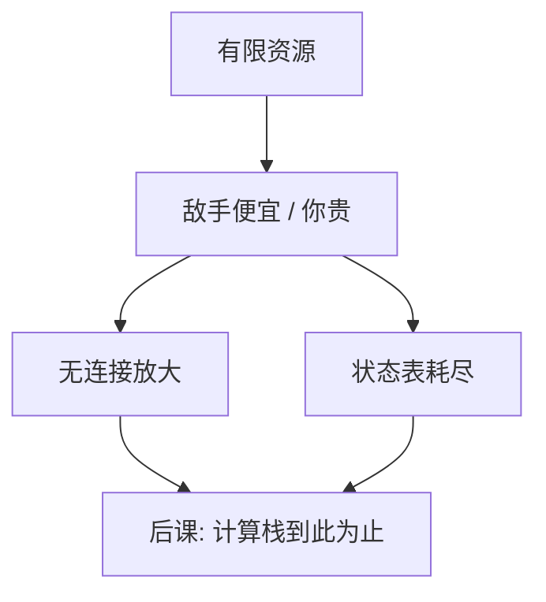

# DoS 与放大

可用可以单独被打穿：请求不需要正确，只要贵；开放的应答器若把小询问变成大回答，攻击者可借别人的带宽。

<footer>—— 据 Anderson 对拒绝服务；RFC 上对放大与 BCP38 源地址验证的讨论</footer>

[上一课](/cs/hsts)处理主动假冒。本课不重做证书绑定。缺口是 CIA 的 **A**：服务可以密码学全对，仍因资源耗尽而停止。[拥塞控制](/cs/tcp-congestion)管的是合作端点；敌手不合作，可以发洪水、耗连接表、或利用无连接协议的放大。本课只讲机制与防御原则，不给操作配方。

## 问题

防火墙状态表、2PC 的 prepared 锁、TLS 握手的公钥运算、都是有限资源。缺口不是「网络会慢」，而是敌手成本可以远低于受害者成本：伪造源地址使应答打向第三人；小查询大响应使带宽放大。TCP 三次握手已有半开连接这一课的对象；这里上升到安全：认证挡中间人，挡不住灌流量。

不描述如何寻找开放解析器、如何构造查询、如何选反射点。防御侧原则：源地址验证、限速、关闭开放应答、握手前便宜的 cookie。

## 方法

缩小放大面：不向互联网提供开放的无认证应答；限制响应/请求比。入站：容量规划、任播、过滤显然伪造的源、SYN cookie 一类把状态推迟到证明对端。应用层：认证与配额，避免未认证的昂贵工作（与最小特权一致：先便宜检查）。本课不指定供应商产品。

## 机制

放大依赖「请求与响应路径分离」加「源可伪造」。BCP38 一类出口过滤从源头削弱伪造，是互联网集体行动，不是单机 TLS 能替代。应用层 DoS 可以全部是合法 TLS 请求，此时只能靠身份、配额与弹性。这把可用从「磁盘没坏」写成威胁模型里的一轴，与[调度指标](/cs/scheduling-metrics)的过载对照：那里假设工作负载诚实。

把昂贵公钥运算放在未证明对端之前，等于为洪水提供杠杆。

## 边界

本课不覆盖物理切断、也不把勒索叙述写成教程。合法突发与攻击在包层面可以像，需要运维策略，不是一门新密码。下一课是本栏主干的最后一课：系统栈到此停，不再进入 Transformer 或限价簿。

应用层配额必须在认证之后仍按身份计，否则未登录的便宜路径会被用来耗尽后端。后课默认：CIA 三轴都已有机制名字；本栏不把大模型或盘口微观结构收进来。

容量与过滤挡的是资源不对称，不是身份。合法用户与敌手在未认证前可以长得一样，因此昂贵工作必须推迟到证明之后。

## 小结
- 开放无认证应答器提供放大；源地址验证是集体防御，单机 TLS 替代不了。
- 下一课封口系统栈，不再把洪水写成新协议。

- 中间人伤 C/I；DoS 单独伤 A，可走洪水、状态、放大。
- 防御：少开放反射、源验证、推迟状态、配额。
- 主干在下一课封口并移交其他栏。
- 出处：Anderson, *Security Engineering*；关于源地址验证与放大的 IETF BCP 讨论。
