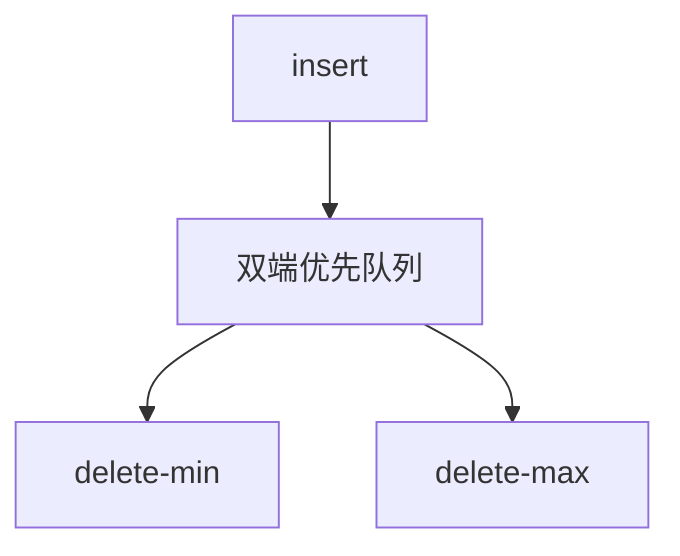

# 双端优先队列

既要 $O(\log n)$ 抽最小，也要 $O(\log n)$ 抽最大；一个堆序不够，除非成对放置或两堆互指。

<footer>—— 据 Knuth, The Art of Computer Programming 卷 3；Sedgewick and Wayne；Cormen, Leiserson, Rivest and Stein 整理</footer>

[上一课](/cs/mergeable-heap)的堆合同围绕同一端极值。[双端队列](/cs/deque) 两端是位置不是键序。本课不 meld。缺口是双端优先队列（DEPQ）：`insert`、`get-min`/`delete-min`、`get-max`/`delete-max`。

## 问题

两个独立堆（一个 min 一个 max）各插一份，删除时要同步删另一边，需要句柄或懒删。间隔堆（interval heap）：完全树每个节点存一对 $(a,b)$，$a\le b$，左端形成 min-heap 序、右端 max-heap 序。或 min-max 堆：偶数层 min、奇数层 max。缺口是**在一份存储里同时维持两种堆序**，避免 $2n$ 全量复制。

Knuth 卷 3 讨论优先队列变体。教材中 interval heap 与 min-max heap 是常见两种表示。

## 方法

insert：放入末叶再沿 min 或 max 路径上滤，视新键与所在对/层的关系。delete-min：与普通堆类似，空洞从根补，但要同时修复另一端序。实现细节因表示而异，合同统一为两端对数。

与有序 BST：顺序统计树也能删最小最大（最左最右），还能 rank；DEPQ 不支持任意键查找，常数按堆。选结构看操作集。

## 机制

不能只用一个 min-heap 另存当前 max 变量：删 max 后 max 未知，除非扫。成对或分层把「另一端候选」永远放在堆路径上。空间 $\Theta(n)$。

不要与 deque 的「两端下标」混淆：DEPQ 的两端是键的极值。

## 边界

本课不把无锁 DEPQ 写完。整数键、宇宙 $[0,U)$ 上找后继，堆帮不上忙——那是 van Emde Boas 的 $O(\log\log U)$，下一课换模型。

后课默认：两端极值用 DEPQ 或有序树。有界整数宇宙上的前驱后继，用 vEB。

## 小结

- DEPQ：min 与 max 都对数，不是位置 deque。
- 表示：interval heap、min-max 堆、或双堆加句柄。
- 整数宇宙前驱后继交给 vEB。
- 出处：Knuth 卷 3；Sedgewick and Wayne；Cormen et al.。
