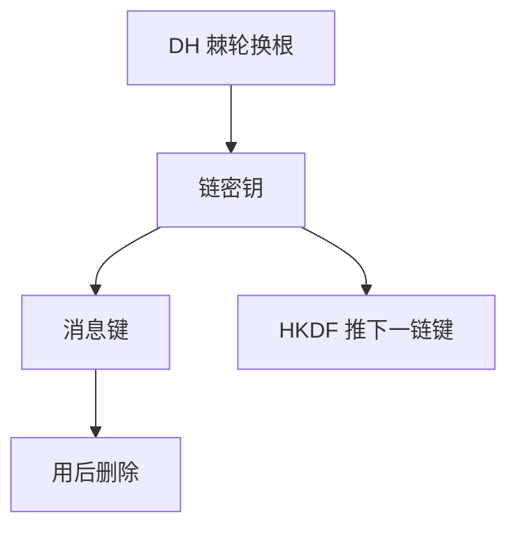

# Signal 双棘轮

DH 棘轮换根，对称棘轮用 KDF 推下一条链密钥：每条消息一把键，过去的键删掉。前向保密变成消息粒度，延迟乱序用跳过的键缓存来收。

<footer>—— Perrin and Marlinspike, The Double Ratchet Algorithm；对照 Krawczyk 的 KDF 提取</footer>

## 定位

上一课[前向保密](/cs/forward-secrecy)停在「每个会话一把临时 DH」。缺口是**长时间对话**：消息很多、可乱序、可延迟。双棘轮把 PFS 推到消息级，并引入后向保密（泄漏后未来仍能自愈）的工程直觉。

后课默认已经读完本课钉下的合同，只补差，不从该领域第一性原理重开。

## 问题

TLS 会话相对短。即时通讯里同一对端持续数年。每条消息都做完整握手太贵。双棘轮：收到新 DH 公钥就进一格 DH 棘轮；同格内用 HKDF 推链。缺口是状态机，不是再定义 ECDH。

### 不是区块链

棘轮是密钥演化，不需要全局账本。不要把本课写成加密货币。

Signal 协议规格公开。本课不写客户端取证步骤。跳过的消息键要限时缓存，否则乱序无法解密。

## 方法

画 DH 棘轮与对称棘轮两条轴。指出会话建立仍要身份（X3DH 只点名）。丢失消息：保留若干跳过键。对照 TLS：记录层序号 vs 消息链。

图中节点是本课的机制骨架；课程不把图展开成可运行的攻击步骤。

## 机制

消息键短命，服务前向：旧密文在键删后不可解。新 DH 进格服务后向：当前链泄漏后，下一格根与之独立。身份仍依赖长期身份钥与预密钥包——那是PKI/信任启动，不是棘轮算术。

前提写进合同之后，游戏外的误用只当失败模式点名，不在本课写成操作程序。

## 边界

本课不把 X3DH 的全部代数写完。后量子下一课：KEM 替换 DH 格时，棘轮形状仍在，困难问题换成格上封装。

## 小结

- 会话级 PFS 不够长对话；棘轮到消息键。
- DH 换根 + HKDF 链；用后删键。
- 乱序靠有限跳过缓存，不是无限保留。
- 下一课：后量子 Kyber/Dilithium 换困难问题。
- 出处：Perrin and Marlinspike, Double Ratchet；RFC 5869；对照 TLS 1.3。
