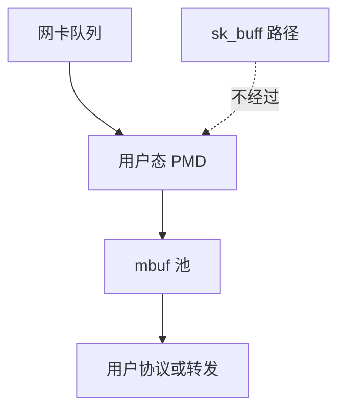

# 内核旁路 DPDK

DPDK 用用户态驱动轮询网卡队列：包在用户 mbuf 池里走完，不经过 sk_buff、NAPI 与套接字。

<footer>—— 据 DPDK 程序员指南；Linux VFIO/UIO 对用户态 I/O 的支持说明</footer>

[XDP](/cs/xdp-ebpf) 仍在内核。[轮询 I/O](/cs/io-polling) 在存储侧已见 busy-wait。缺口是 **网络旁路**：DPDK 一类框架把 NIC 绑给进程。本课讲 OS 位置，不是教程。

## 问题

内核路径：中断/NAPI、skb、协议、系统调用。旁路：进程 mmap 寄存器与描述符环，poll，自己实现以太网/IP 或把帧再注入内核。缺口：设备从内核解绑（`vfio-pci`），IOMMU 保护 DMA；无内核 TCP 则要用户态栈或只做 L2 转发；与普通 socket 应用不兼容。本课不把每家 PMD 列成表。

AF_XDP 是折中：内核驱动填 umem，用户 poll。DPDK 更彻底。CPU 隔离与 [cpuidle](/cs/cpuidle-cstate) 冲突：轮询核不睡眠。

## 方法

启动：绑定网卡到 vfio，hugepage 池。运行：每核一队列 RSS，收 mbuf，处理，发。需要与内核互通时：tap/KNI 或 virtio。对照 [NVMe 用户态](未单列)：同样是 poll + 用户驱动。对照 tun：tun 仍经内核虚拟设备；DPDK 直接硬件。

## 机制

旁路用 CPU 与隔离核换最低每包成本，适合网关与 NFV。OS 仍提供：IOMMU、中断（可选）、内存、调度其余核。不要写成「不用操作系统」。与 [blkio](/cs/blkio-cgroup)：旁路流量可能看不见内核 netfilter，策略要在用户态重做。

安全：用户进程 DMA 能力靠 IOMMU 限制到该设备；配置错误则危险。

实现上：绑定 vfio-pci 后内核不再收包，ssh 会断，要留管理口。hugepage 泄漏会把机器钉死。与内核互通常靠 virtio-user 或 tap，那一段又回到 skb。 读法上只引用[上一课](/cs/xdp-ebpf)的结论，不把对象换成训练推理或限价簿。

本课在操作系统进阶的「网络栈 / 收发路径」课序里，对象是 **内核旁路 DPDK**。

- 先修只引用，不重导：上一课的结论当公理，本课只补差。
- 五栏不吞并：不把本课写成大模型训练/推理，也不写成限价簿或权重量化。
- 文献用 OSTEP、McKusick、内核文档与具名会议论文；不发明 arXiv 编号。

## 边界

本课不引入 DPDK 的全部库（timer、cryptodev）。不保证实时许可证下的延迟数字。下一课回到内核路径上的并行：RSS 与多队列。

版本字段会变，课序钉的是机制对象「内核旁路 DPDK」，不是某一主线内核的结构体名。
后课默认：包可以完全在用户态收发。内核多队列如何把流散到 CPU，下一课 RSS。

## 小结

- DPDK 用户态轮询 NIC，绕过协议栈。
- 依赖 VFIO/IOMMU；与 socket API 分裂。
- RSS 多队列是下一课。
- 出处：DPDK 文档；VFIO；Linux UIO。
