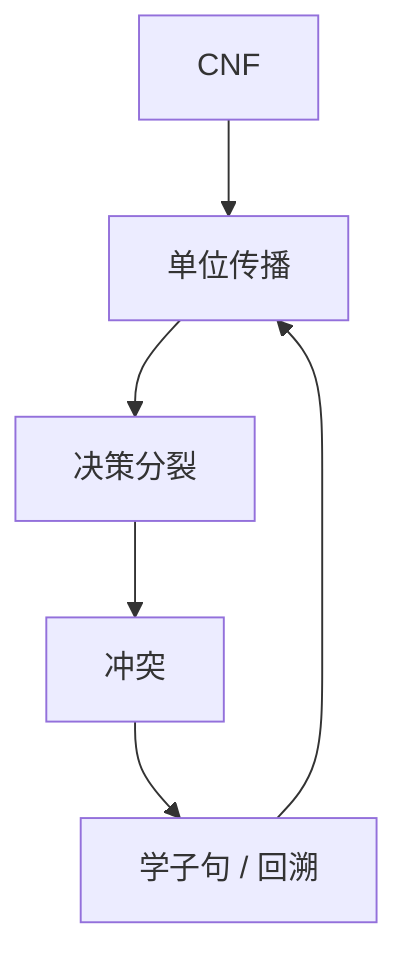

# DPLL 与 CDCL

DPLL：单位传播、纯文字、分裂。CDCL 在冲突上做子句学习与非时序回溯，现代 SAT 求解器靠这一循环吃下工业 CNF。

<footer>—— 据 Davis, Putnam, Logemann and Loveland, 1962；Marques-Silva and Sakallah；Biere et al., Handbook of Satisfiability 整理</footer>

上一课[LTL/CTL](/cs/ltl-ctl) 的有界路径会编成 SAT。主干[SAT/3-SAT](/cs/sat-3sat) 只谈完全性。缺口是**求解**：DPLL 与 CDCL。不重证 NPC，不保证多项式——只保证可靠完备的搜索。

## 问题

CNF。单位子句强迫赋值（BCP）。纯文字可定。否则选变元分裂。冲突则回溯。CDCL：分析冲突蕴含图，学一条切割子句，跳回该子句的第二高决策层（非时序）。重启、活动启发式（VSIDS）是工程。2-SAT 线性；一般 CNF 指数最坏，实践远好于真值表。

Tseitin 课的等可满足 CNF 是输入形态。求解器不管原公式树。

### 学习不是机器学习

学的是逻辑后承子句，可靠。启发式才是经验。不要把 SAT 求解写成训练。

DP 1960、DLL 1962。GRASP、Chaff 开创 CDCL。Handbook of Satisfiability。本课不把 DRAT 证明日志写完，点名：可独立校验。

## 方法

用 4 子句小例子走一遍单位传播到冲突，画蕴含图，学一条子句。对照归结：学习子句是归结的压缩。指出：有界模型检验把 $k$ 加大，反复调用同一引擎。

## 机制

NP 证书是赋值；求解器找证书或证 UNSAT（后者是 coNP 对象，靠学习子句推导 $\bot$）。CDCL 把[Cook–Levin](/cs/cook-levin) 的「难」留在最坏，工业实例有结构。SMT 下一课在 CDCL 外挂理论传播。

完备：无限内存、无重启公平性条件下可穷尽。实践有时限。

VSIDS 给最近冲突的变元加分，重启清空决策但保留学习子句。DRAT/LRAT 让 UNSAT 可独立校验，对应 coNP 证书的工程版。相位保存、子句删除策略决定内存。有界模型检验里 $k$ 增大则 CNF 变长，同一引擎反复跑。最坏仍指数，NPC 未崩。

## 边界

本课不写手表启发式全文，不引入 MaxSAT。不把量子退火当 SAT。后课默认：命题核是 CDCL。下一课理论组合：SMT。

单位传播加冲突学习把工业 CNF 变成可解实践，最坏仍指数。UNSAT 靠推导空子句，并可外挂证明日志。理论原子下一课交给 SMT，布尔核仍是本课循环。

## 小结

- DPLL = 传播 + 分裂；CDCL 加冲突学习与非时序回溯。
- 可靠完备搜索，不是多项式算法。
- 有界模型检验与验证条件都交给它。
- 出处：Davis et al., 1962；Marques-Silva and Sakallah；Handbook of Satisfiability。
