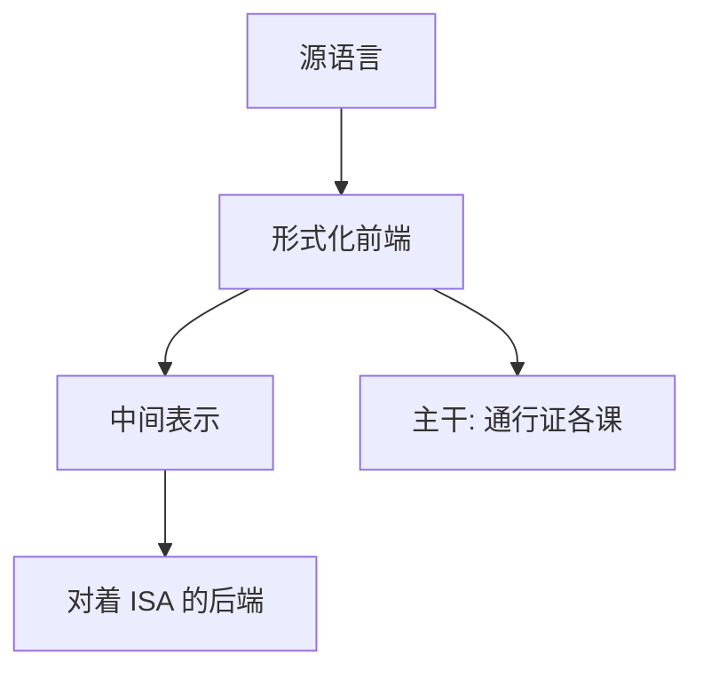

# 龙书 Aho–Sethi–Ullman

编译是一串通行证：词法、语法、语义、中间代码、优化、目标代码；前端用形式语言，后端对着 ISA。

<footer>—— Aho, Sethi and Ullman, Compilers: Principles, Techniques, and Tools（龙书）</footer>

[上一课](/cs/patterson-hennessy)附录对照了体系结构教材。附录对照，不插入主干。主干已在[编译器通行证](/cs/patterson-hennessy)、[正则与词法](/cs/regex-lexer)、[LR 与移进归约](/cs/lr-shift-reduce)、[SSA](/cs/ssa-form)、[寄存器分配着色](/cs/regalloc-color)里按通行证取用；这里对照 **龙书的问题**：如何把编译写成可证明的前端加可工程的后端。不重做 FIRST/FOLLOW 表。

## 问题

主干编译课接在 NPC 之后、OS 之前，对象是把高级语言落到 ABI。龙书的缺口是把自动机、文法、数据流做成同一条生产线。1986 初版与后版增加了更多优化；主干只取通行证骨架与 SSA 一代的数据流，不把全书练习插进课序。

龙书不是唯一编译教材。Appel、Cooper/Torczon 等是对照。主干用龙书当「通行证与形式化前端」的文献锚，不排斥 SSA 在后版中的位置。

## 方法

词法：正则 → 自动机。语法：CFG → LL/LR。语义：符号表与类型。IR：三地址。优化：数据流不动点。后端：选择、分配、调度。主干[窥孔](/cs/peephole)与[ABI](/cs/abi-codegen)已接 ISA 课。附录对照这本书为何能当「编译课的出处」，而不是再讲一遍活跃变量方程。

## 机制

形式化前端使「语法错」有定义；数据流使优化有不动点而不是补丁列表。这与 Knuth 分析算法、Patterson 量化硬件同一精神：对象可推理。运行时与 GC 在主干[运行时与 GC 直觉](/cs/runtime-gc)，龙书也谈，但不插入本附录当新课。

### 为何对照而不插入主干

若按龙书章节插在数据结构中间，自动机会打断树与图。主干把形式语言放在编译课，前面只用正则当工具。附录只对照教材作为通行证的文献。

## 边界

不要把「龙书封面」当引用。下一篇对照 Tanenbaum《现代操作系统》如何把进程、内存、文件、I/O 收成教材，主干 OS 课已经按映像与系统调用走过。

属性文法与语法制导翻译是前端语义的教材写法；主干[类型检查](/cs/typecheck)已取用检查，不把 AG 公式插进课序。

对照结束应回到主干[编译器通行证](/cs/compiler-passes)。龙书目录不替换知识树。

## 小结

- 附录对照龙书：编译 = 通行证，前端形式化，后端对 ISA。
- 主干编译各课已按此骨架取用。
- 不按全书练习重排知识树。
- 出处：Aho, Sethi and Ullman, *Compilers: Principles, Techniques, and Tools*。
