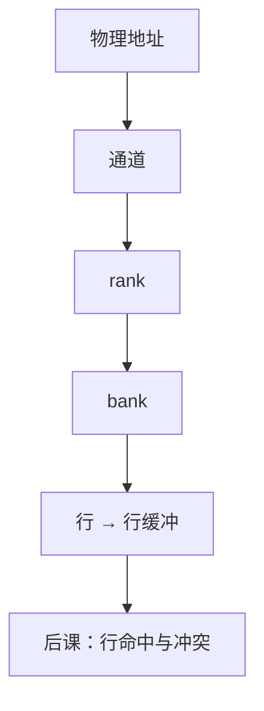

# DRAM 组织：通道 / rank / bank / 行

  
一次 cache 缺失打到的不是「一根延迟数」，而是通道上某 rank 里某 bank 的某一行：并行度藏在这套层次里。

  <footer>—— 据 JEDEC DDR SDRAM 标准；Hennessy and Patterson, CA:AQA；Patterson and Hennessy, Computer Organization and Design (RISC-V) 整理</footer>

[上一课](/cs/aging-reliability)把 HDL 实现课序封口，时序要在寿命期内成立。组成课已有[阵列](/cs/memory-array-sram-dram)、[刷新](/cs/dram-refresh)与体系结构课的[DRAM 时序](/cs/dram-timing)。缺口是把 JEDEC 的**层次名词**钉死：channel / rank / bank / row / column，供后课行缓冲与命令用。本课程仍是比特到系统，不进限价簿，不写光刻 DRAM 电容工艺。

## 问题

1T1C 排成矩阵：行选通到灵敏放大器，列再选出。多 bank 让不同行操作重叠。rank 是同一通道上共享命令/数据总线、独立片选的一组颗粒。通道是独立的控制器与总线。缺口不是再讲刷新电荷，而是：**物理地址的哪些位选中哪一层**——映射本身下一课之后才展开，本课先认结构。

数据宽度：×8 颗粒拼成 64 位（ECC 再加 ×8）。突发长度把一次列命令变成连续若干传送，对上 cache 行。

### 通道不是「NUMA 节点」

NUMA 是多控制器在互连上的亲和；单 socket 多通道仍是同一一致性域里的并行带宽。把 channel 写成远程内存，后课调度会把本地 bank 冲突当成网络。HBM 用硅中介层当「很宽的通道」，组织层次仍在。

JEDEC 为 DDR 各代定义 bank 组、bank、行、列命令。CA:AQA 用这些层次解释带宽。Patterson/Hennessy 教学用简化的行列。本课钉词汇，不背某代 $t_{RCD}$ 纳秒表。

## 方法

读请求：译码到 channel → rank（CS）→ bank → 若行未开则 ACT → 列 READ → 突发数据上 DQ。写对称。刷新按 rank 或 bank 粒度插命令。多通道：独立命令流，地址交织后课讲。

bank 组（DDR4/5）限制同组时序，组间更自由——点名，细节在协议课。

## 机制

软错误 ECC 的 ×72 宽度落在 rank 的颗粒拼宽上。控制器必须遵守每 bank 的状态机，不能把 DRAM 当 SRAM 随机字访问。后课 FR-FCFS 调度的对象正是这些 bank 的打开行。

## 边界

本课不讲 3D NAND 的 block/page（闪存后课），不把 HBM 堆叠工艺写成光刻。不讨论 GDDR 与显存市场。

后课默认：主存请求落在通道–rank–bank–行–列；并行来自多 bank/多通道，不是来自「DRAM 无状态」。

## 小结

- JEDEC 层次：通道、rank、bank、行、列。
- 行打开后列突发才出数据；刷新仍在。
- 下一课专门讲行缓冲命中与 bank 冲突。
- 出处：JEDEC DDR；Hennessy and Patterson, CA:AQA；Patterson and Hennessy, COD。
