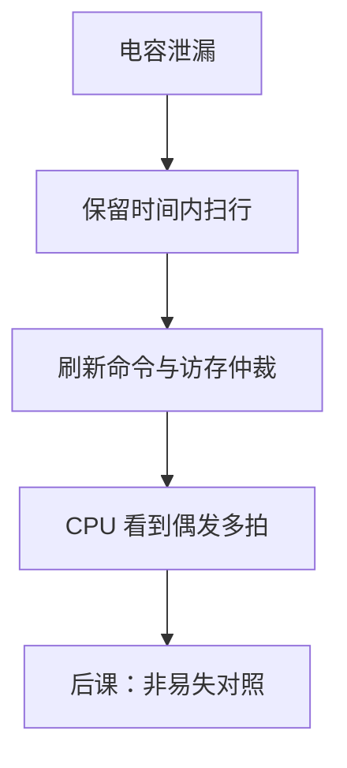

# DRAM 刷新

电容上的电荷会漏；必须在保留时间内把每一行读出再写回，否则比特自己消失，与 CPU 有没有访存无关。

<footer>—— 据 Harris and Harris, Digital Design and Computer Architecture；Patterson and Hennessy, Computer Organization and Design (RISC-V) 整理</footer>

上一课[SRAM 与 DRAM 阵列](/cs/memory-array-sram-dram)钉死了 1T1C 与破坏性读。本课不重画字线位线，也不从文件系统掉电另起。缺口是把「必须刷新」写成**控制器义务**：间隔、与访存争用、对 CPU 呈现的多拍空洞。

## 问题

电荷泄漏给出保留时间 $t_{\mathrm{REF}}$（温度越高越短）。$R$ 行要在该时间内各刷新至少一次，平均间隔 $t_{\mathrm{REF}}/R$。刷新：选一行，读到灵敏放大器，写回——与破坏性读同一套。缺口不是新的单元物理，而是：刷新命令与 CPU 的激活/预充电抢行，控制器要仲裁。

SRAM 交叉耦合不刷新。把主存当组合 ROM 的单周期图，把这一格藏掉了。

### 刷新不是「定期 dump 到磁盘」

不是交换、不是断电保存。是阵列内部的读-回写，掉电仍丢。把 refresh 理解成 checkpoint，后课闪存的非易失会对不齐。

Harris 强调保留时间。Patterson/Hennessy 把 DRAM 延迟与控制器放进性能。JEDEC 的 $t_{\mathrm{REFI}}$ 是工程定额，本课只取「行遍历周期」这一层。

## 方法

集中刷新：停访存、扫完全部行。分散刷新：穿插在命令流里。自刷新：空闲时 DRAM 内部计数。CPU 侧看到的是偶发额外延迟，不是每个 `lw` 都刷新。

## 机制

后课单周期教材仍可把数据存储器画成一拍；组成主干记得真实 DRAM 有刷新与打开行。纠错码可在刷新时顺带 scrub，本课不展开 ECC。温度补偿刷新是同一义务的参数，不是另一种存储。

## 边界

本课不讲 DDR 突发时序表（那是[DRAM 时序](/cs/dram-timing)一类后叶）、不讲 3D 堆叠。闪存的擦除/编程不是刷新。

后课默认：DRAM 正确性依赖刷新控制器；与 CPU 时钟可以不同源，为时钟域课留口。

## 小结

- DRAM 必须在保留时间内刷新每一行。
- 刷新与访存争用，由控制器仲裁。
- 掉电不保存；SRAM 无此义务。
- 出处：Harris and Harris；Patterson and Hennessy, COD (RISC-V)。
