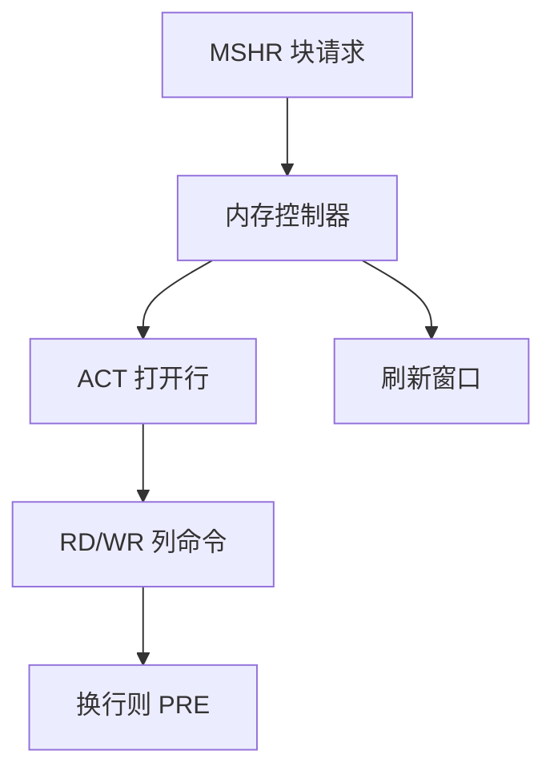

# 内存控制器与 DRAM 时序

一次 cache 缺失不是「一个 DRAM 延迟」：行要打开，列要选，预充电要等；控制器把这些命令排成日程。

<footer>—— 据 Hennessy and Patterson, Computer Architecture: A Quantitative Approach；对照 JEDEC SDRAM 时序参数 整理</footer>

[上一课](/cs/interconnect-numa)让远程访问走互连，并假定本地内存仍是一个均匀的延迟数。[SRAM 与 DRAM 阵列](/cs/memory-array-sram-dram)已说明电容与刷新。本课不重讲 NUMA 拓扑。缺口是内存控制器：把 MSHR 传来的块请求翻译成 ACT/RD/WR/PRE 命令，遵守 $t_{RCD}$、$t_{CAS}$、$t_{RP}$ 一类间隔。体系结构课在此把「缺失代价」收成可调度的时间表。

## 问题

DRAM 按 bank、行、列组织。读指定列之前，该 bank 必须已打开正确的行（ACT，等 $t_{RCD}$），再发读（等 $t_{CAS}$）。换行要先 PRE（等 $t_{RP}$）再 ACT。同一 bank 上的请求若行冲突，延迟远大于行命中。缺口不是再加一层 cache，而是**控制器选择先服务哪一个 MSHR，以增加行命中、遵守时序、并在刷新窗口插入 REF**。

通道、rank、bank 并行：独立 bank 可交叉，把块填充的有效带宽拉上去。NUMA 的「本地」仍过这一套；远程只是请求先到别的控制器。

教材常把 $t_{CAS}$、$t_{RCD}$、$t_{RP}$ 写成一组。绝对纳秒随产品变，本课钉结构和相对关系，不背某代 DDR 的数字。

## 方法

控制器维护每 bank 的打开行。策略：先到先服务会打进行颠簸；常见是优先同行请求、在公平性约束下调度。写缓冲与读请求冲突时，往往攒写、读优先，以免 load 等一串 store。

ECC、突发长度、命令/地址与数据总线的时分，本课只承认它们影响一次填充的拍数。

## 机制

cache 缺失代价 = 排队 + 命令间隔 + 数据突发。预取与写回会改变队列成分：预取可能提高行局部性，也可能挤掉需求读。包含层次决定写回落在哪一层，最终仍可能变成 DRAM 写。

[阿姆达尔](/cs/cpi-amdahl)：只加速 ALU 不管控制器队列，存储器 $f$ 封顶。操作系统的页放置改变的是「哪一个控制器」，不改变 bank 时序规则。

## 边界

本课不进入 HBM 堆叠工艺，不把具体 DDR 代数当课名。也不把控制器调度写成操作系统磁盘电梯——对象是纳秒级命令，不是毫秒级寻道。数据结构课即将开始：程序员选的布局会改变行命中与 cache 轨迹，但 ADT 先从接口讲起。

后课默认：DRAM 访问有行状态与时序；缺失代价不是常数。下一课程用抽象数据类型命名可复用的比特布局。

## 小结

- 控制器把缺失变成 ACT/列/PRE/刷新日程；行冲突比行命中贵。
- 调度与多 bank 交叉决定有效缺失延迟。
- 体系结构主干收到这里；下一课开始 ADT。
- 出处：Hennessy and Patterson, *CA:AQA* DRAM 与内存系统；JEDEC SDRAM 时序参数命名。
