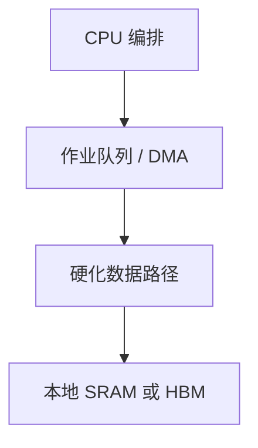

# 领域专用加速器

把热点循环的数据路径硬化，去掉通用译码、重命名与一致性的税；换来的是硅与编译器都只服务一类算法。

<footer>—— 据 Dally, Turakhia, and Han, Domain-Specific Hardware Accelerators, CACM 2020；Hennessy and Patterson, CA:AQA 整理</footer>

[上一课](/cs/systolic-array) 给出一种硬化形状。[VLIW](/cs/vliw-epic) 仍是可编程指令束。本课不重画 PE 网格。缺口是 **DSA：为领域固定流水、存储层次与数值格式，CPU 只做编排。** 本栏不重写 Transformer 训练栈——那是大模型栏；这里只谈「为何通用乱序核不够、加速器收走哪一笔税」。

## 问题

[深流水](/cs/deep-pipeline-clock) 与 [IQ 唤醒](/cs/issue-queue-wakeup) 服务任意程序。热点若稳定（编解码、密码、稠密线性代数），每拍都在付通用税。缺口不是再加 SIMT 占用率，而是**用固定或轻度可编程的数据路径跑那一类循环，用 DMA 与队列和 CPU 衔接。**

Dally 等强调：专用化吃的是可编程性与 Amdahl 的串行/不规则段。接口、缓存一致性是否参与、虚拟内存，是 SoC 课的问题。

## 方法

加速器：专用 PE + 本地 SRAM + DMA。CPU：系统调用或用户态队列提交作业，fence 等完成。一致性：有的参与 [目录](/cs/directory-scalability)（贵），有的用显式拷贝。数值：窄类型、饱和算术，ISA 通用核不必有。

## 机制

[阿姆达尔](/cs/cpi-amdahl)：加速比受不能卸载的段限制。与 GPU：GPU 仍是宽可编程 SIMT；DSA 更窄。与量化栏的金融加速无关：本课不写 LOB。与大模型栏：张量核属于 DSA 家族，细节不在本课展开。

虚拟内存与 IOMMU：加速器若直接用用户指针，要走地址翻译与权限，否则只能 DMA 物理缓冲。一致性参与则目录流量涨，不参与则必须显式 flush/invalidate。这是 SoC 集成税，不是算法税。

## 边界

本课不列产品清单。近存计算下一课把「DMA 进来算」改成「在内存侧算」。异构 SoC 再下一课把大小核与加速器放在同一硅上。

后课默认：领域热点可以卸载。数据搬运本身若占主导，应考虑近存。

## 小结

- DSA 去掉通用前端与一致性税，服务稳定热点。
- 加速比受编排与不可卸载段限制。
- 把运算挪到内存侧是下一课 PIM。
- 出处：Dally, Turakhia, Han, *CACM*, 2020；Hennessy and Patterson, *CA:AQA*。
