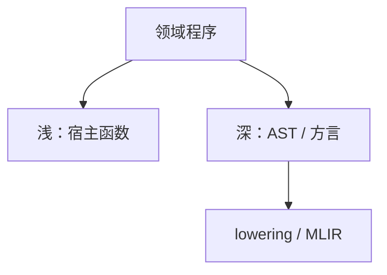

# DSL 与嵌入

领域语言可以是独立语法，也可以嵌入宿主：深嵌入建 AST 再编译，浅嵌入用宿主函数与重载当语法。

<footer>—— 据 Hudak, Building Domain-Specific Embedded Languages；Fowler 对 DSL 的讨论；对照[宏](/cs/macros-hygiene) 与 MLIR 整理</footer>

上一课[MLIR](/cs/mlir) 给了编译基础设施。缺口是**语言从哪来**：SQL、正则、构建图。嵌入：Haskell 浅嵌入、Lisp 宏、Rust proc macro。本课钉深/浅，CompCert 下一课把「编译器该对」收束。不写业务 DSL 百科。

## 问题

独立 DSL：自己的 lex/yacc，要卫生、错误恢复、JIT 或解释。嵌入：复用宿主类型与工具。浅：组合子，难做跨函数优化。深：数据表示，可 lowering 到 MLIR/LLVM。缺口是**这条选择**，不是方言表。

宏：可当嵌入的语法糖，卫生课已讲捕获。

### 浅嵌入不是「没有编译」

仍有宿主编译。只是没有第二份优化器看见领域结构，除非重载技巧或多阶段（MetaOCaml）。

Hudak 1996。Fowler。Lua 作嵌入语言是另一方向（宿主嵌解释器）。本课编译器视角。

## 方法

浅：运算符重载建表达式模板（C++ Eigen 思想）。深：GADT 或 MLIR op。多阶段：生成宿主代码再编译。错误：深嵌入可发领域诊断；浅则是宿主类型错。

与[PEG](/cs/peg-packrat)：独立 DSL 前端常用。与 Wasm：DSL 可目标 Wasm 沙箱。

## 机制

阶段混淆：浅嵌入在宿主运行时才算，可能把本该编译期的工作推迟——性能坑。不要用字符串拼接生成代码当卫生 DSL。

类型：嵌入要不要依值/线性，跟宿主走。

## 边界

本课不写 CompCert。后课默认：DSL 可独立或嵌入；深嵌入才好降到多层 IR。下一课 CompCert 与编译器正确性。

也不把 DSL 当网络协议 IDL 的全部。

## 小结

- 独立 DSL vs 浅/深嵌入，优化可见性不同。
- 深嵌入接到 MLIR/LLVM；浅复用宿主。
- 宏是嵌入的语法手段，要卫生。
- 出处：Hudak；Fowler；对照 Kohlbecker 宏、Lattner MLIR。
