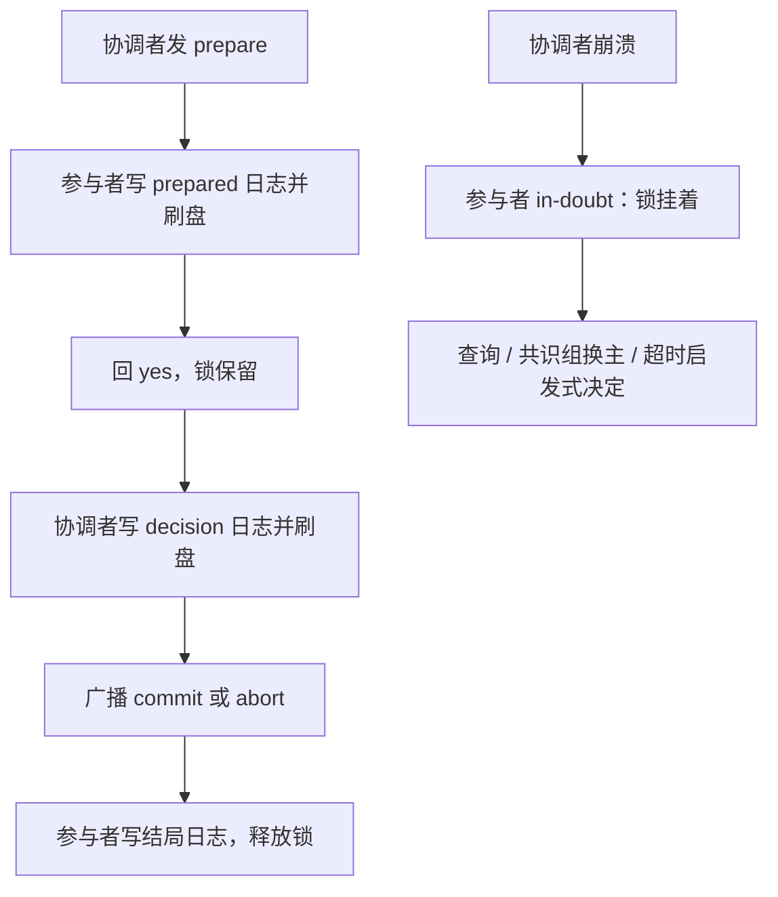
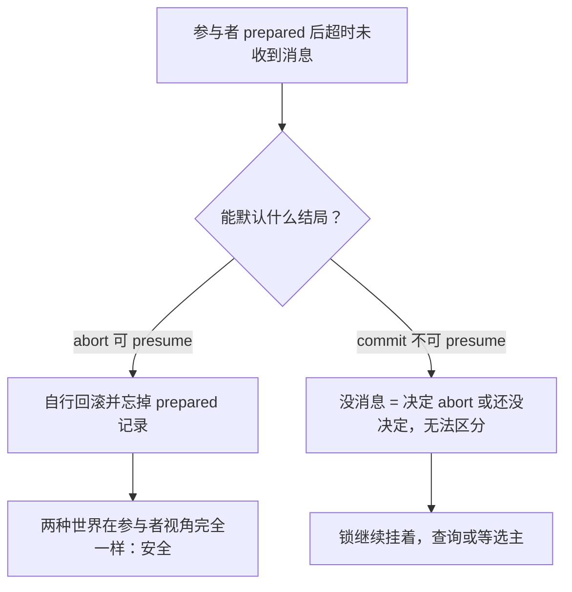

# 2PC 的实现细节

协议图只画两轮消息；实现里多出来的东西——prepared 日志、不确定窗口、启发式决定——才是两阶段提交的真实成本。

<footer>—— 据 Gray, Notes on Data Base Operating Systems, 1978；Gray and Reuter, Transaction Processing, 1993 整理</footer>

[上一课](/cs/qo-case-map)给「查询优化深化」收束：诊断沿数据流逆行——先看估计与实际之比，再查统计，再查尺子，最后才轮到改写；每层修复配一个判据，没有判据的修复是化妆。查询优化的判据收了档，事务这条线的判据更硬：提交要么发生、要么没发生。本课是「分布式事务深化」的第一课，打开协议图下面的实现账：prepare 应答前先落什么盘、决策记在哪、不确定窗口里锁归谁管、悬挂事务由谁收拾。主干课的 [Spanner 与 TrueTime](/cs/spanner-truetime) 给过跨组 2PC 的外观，本课补的是任何实现都躲不开的内部序。后课的 Percolator 式与 Calvin 式路线，都默认你已知道这套账。

## 问题

主干只给了 canCommit、commit、abort 三句话。实现要回答的全是「先写日志还是先回消息」：参与者应答 yes 之前，必须先把 prepared 记录连同 redo/undo 信息刷盘——否则应答之后崩溃，恢复时既不能提交也不能回滚，还占着锁。协调者收齐 yes 后，先写决策记录再广播：广播可以丢，决策不能丢，丢了全组无人有权收场。缺口是把两轮消息变成一条**崩溃安全的日志序**。每一步的先后顺序就是正确性本身；顺序对了，剩下的都只是延迟与吞吐问题，顺序错了，崩溃恢复时系统连「自己决定过什么」都无从谈起。

固定税目：约两轮消息加三处强制刷盘——参与者 prepared、协调者 decision、参与者结局记录。跨洋链路一轮往返按百毫秒计，这段时间事务的锁全部持有；吞吐按锁持有时间的倒数掉，不是按 CPU 掉。

## 方法

账目走一遍。参与者收到 prepare：写 prepared 记录、刷盘、回 yes，锁从此保留到结局到达。协调者收齐：写 decision 记录、刷盘、广播 commit 或 abort。参与者收到结局：写结局记录、释放锁、回执。消息要幂等：协调者恢复后重发决定，参与者可能已提交过，重复收到 commit 不能产生第二次对外效果——用日志里的状态去重。悬挂事务（in-doubt）：协调者迟迟不回时，参与者不能自定结局，只能反复查询、等协调者所在共识组换主补发决定，或超时后由管理员做「启发式决定」；他定的方向若与协调者相反，系统只能记录不一致并告警，因为已对外公布的提交不可撤销。

## 机制

优化全部指向「能不能少写、少问、少等」。Presumed Abort：abort 是可以默认的结局——参与者超时未听说协调者，就自行回滚并忘掉 prepared 记录，因为「没消息」与「决定 abort」不可分辨；commit 没有默认答案，「没消息」也可能是「决定还没做」，不能 presume。协调者换主：把协调者状态放进共识组（Spanner 让锁表与提交记录由 Paxos 组持有），不确定窗口从「等一个进程」缩成「等一次选主」，这正是主干口径「共识复制 commit 决策」的兑现。三阶段提交想再进一步，在 prepare 后插一轮 pre-commit，让参与者提前知道「大概率提交」；代价是三轮消息，而且异步网络分区下仍要靠协调者超时收场，工程上极少有人用这一轮去换那一点恢复速度。

数字实例：固定税目算一遍——两轮消息跨洋各约 100 ms，加上三处强制刷盘每次几毫秒，一次跨库事务的锁要持有约 200 ms 以上。单机事务全程微秒级，两者差五六个数量级；吞吐按锁持有时间的倒数掉，这就是「能不用分布式事务就不用」的算术根据。

直觉类比：不确定窗口像网购后物流失联——商家说「考虑退款还是发货」，然后没了消息。你既不能拆包也不能退回（不知道最终决定），只能占着收货位干等。「启发式决定」就是等了三天你自作主张拆了包，结果商家其实决定了退款——系统只能记录这笔不一致并告警。

常见误区：初学者容易以为 2PC 卡住只是「消息丢了，重发就行」。真正的问题是参与者无权私自定结局：「没收到消息」可能是协调者还没做出决定，也可能只是消息丢了——参与者无法区分这两种世界，所以哪怕重发有用，也只能先挂着锁等。

## 边界

本课不复述共识协议本身，不重算 [Spanner 与 TrueTime](/cs/spanner-truetime) 的时钟账，也不把 Saga 补偿当成提交协议——补偿是业务失败后的应用层动作，语义与原子提交不在同一层。XA 是接口名，不是第四种协议，它的 prepare/commit 只是这套日志序的函数签名。后课默认：任何「分布式事务」产品，底下要么是这套账，要么把协议整个换掉——下一课看把协调者塞进数据表的做法。

## 小结

- 实现核心是日志序：先 prepared 刷盘再应答，先 decision 刷盘再广播；两轮消息加三处强制刷盘是固定税。
- 不确定窗口里锁必须保留；悬挂事务只能查询、换主或超时启发式，不能私自定结局。
- Presumed Abort 让 abort 免决策日志；commit 没有默认答案，不能 presume。
- 决策状态进共识组，阻塞窗缩成选主窗；3PC 多一轮消息换不来分区安全。
- 出处：Gray 1978；Gray and Reuter 1993；Mohan 与 Lindsay 的 presumed abort；Corbett et al. 2012。
