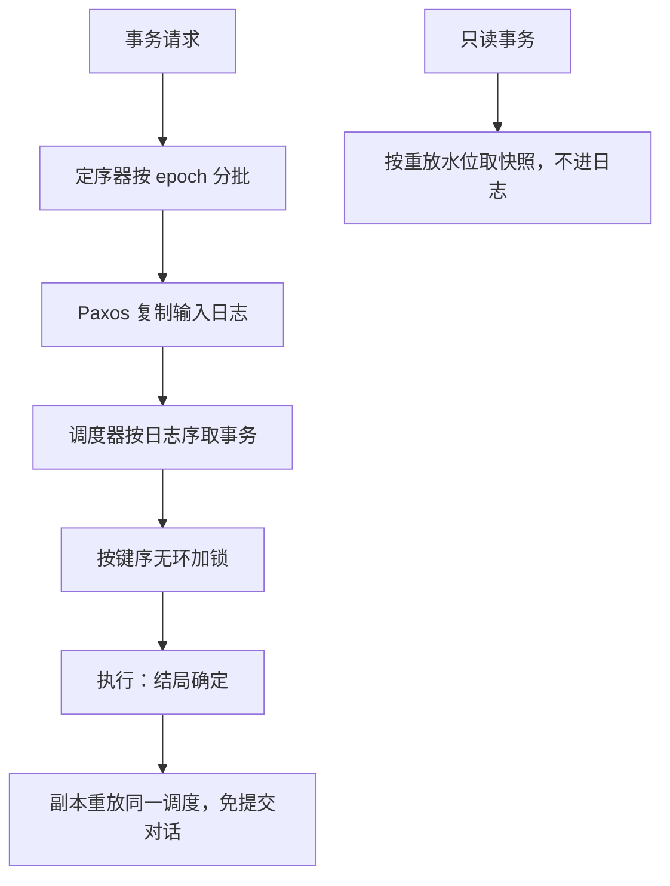

# Calvin 与确定型数据库

让所有副本看到同一份输入日志，调度就成了从日志算出来的函数；提交无需商量，因为每个副本独立算出同一个答案。

<footer>—— 据 Thomson et al., Calvin: Fast Distributed Transactions for Partitioned Database Systems, SIGMOD 2012</footer>

[上一课](/cs/dt-percolator-tidb)的锁躺在数据表里，协调靠主锁与 TSO。本课换路线：主干课的 [Calvin 确定性](/cs/calvin-deterministic)给过「先定序、再执行」的一页，本课拆它的三个部件——定序器、调度器、工作线程——并算清它整块省掉了什么、又把什么变成了硬约束。下一课的谱系按路线分家，这是其中最激进的一条。

## 问题

非确定性数据库里，副本复制的是「结果」，于是提交要 2PC、死锁要跨节点检测、恢复要各副本对账。缺口是**把复制对象从结果换成输入**：事务文本与参数先进全局有序日志（用 Paxos 复制），副本各自按同一序重放，结局必然一致——上一课与前课的提交对话、跨节点等待环，在确定性的世界里整块消失。代价立刻到账：调度器在执行前必须知道事务的读写集，否则不知道要锁哪些键；热键在日志序里天然串行；分批定序给写延迟加了下限。本课的账，是「省掉的协调」与「必须预知访问」之间的交换。

## 方法

三个部件各管一段。定序器把请求按 epoch 分批——论文用 10 毫秒量级——批内经 Paxos 复制后按槽位号广播；这是写延迟的下限，也是全库写入的聚合点。调度器按日志序取事务，按键序无环地获取锁：同一批内的锁请求按键排序，等待图从构造上就不成环，[分布式死锁](/cs/distributed-deadlock) 课提过的这手预防在这里是常规操作。工作线程执行并落盘；无依赖的事务并发跑，依赖冲突时乐观重跑一遍——结局仍确定，只是多算一次。副本即重放：日志追平即恢复，备库异步追日志，主备切换不需要提交协议裁决。只读事务另走低延迟路径：从重放水位取快照直接读，不进日志——否则一条 SELECT 也要排队定序，延迟账就没法看了。

确定性是一份合同：输入序相同，调度与结局必然相同。破坏函数性的东西必须出事务——now()、随机数、外部副作用，要么在日志里留下种子，要么挪到事务外；合同一破，副本各算各的，免提交对话的整个前提就没了。

## 机制

执行期仍要协调，但协调的形式变了：锁还是要取，只是取法有序；跨分片还是要同时动多片，只是不存在「两边各自决定结局」的时刻。读集预知有两种解法：客户端预声明（存储过程式，事务文本里写清访问哪些键），或侦察事务先跑一遍把读集记下来再定序——前者限制表达力，后者加一轮延迟，论文两者都实现了。吞吐上限在定序器：全局一条日志，定序带宽就是全库写事务的天花板；按分区拆定序器只能缓解单分区内的争用，跨分区事务仍要合成全序。与上一课对照：Percolator 用「锁在表里加全局时间戳」换掉协调者进程，Calvin 用「日志即调度」换掉锁表与提交对话；前者适合读多写少的短事务负载，后者适合访问模式可预知、跨片事务比例高的流。

## 边界

本课不重讲 Paxos/Raft 本身（共识课已给），不算侦察事务对特定负载的延迟公式，也不把 Calvin 等价于流处理——它的日志是事务输入日志，语义仍是 ACID，不是 at-least-once 管道。确定性也不是免日志：日志只是从物理 redo 换成输入文本，恢复的账单换了一张纸，没有免单。下一课把三条路线摆进产品谱系，看它们各自变成了谁。

## 小结

- Calvin 把复制对象从结果换成输入日志：副本重放同一调度，2PC 与分布式死锁检测整块省掉。
- 硬约束是访问集预知：客户端预声明或侦察事务；热键在日志序里串行。
- epoch 分批给写延迟设下限（论文 10 毫秒量级）；定序器吞吐是全库写天花板。
- 只读走重放水位的快照路径，不进日志；确定性要求时间与随机出事务。
- 出处：Thomson et al., SIGMOD 2012；与 2PC、Percolator 路线对照。
