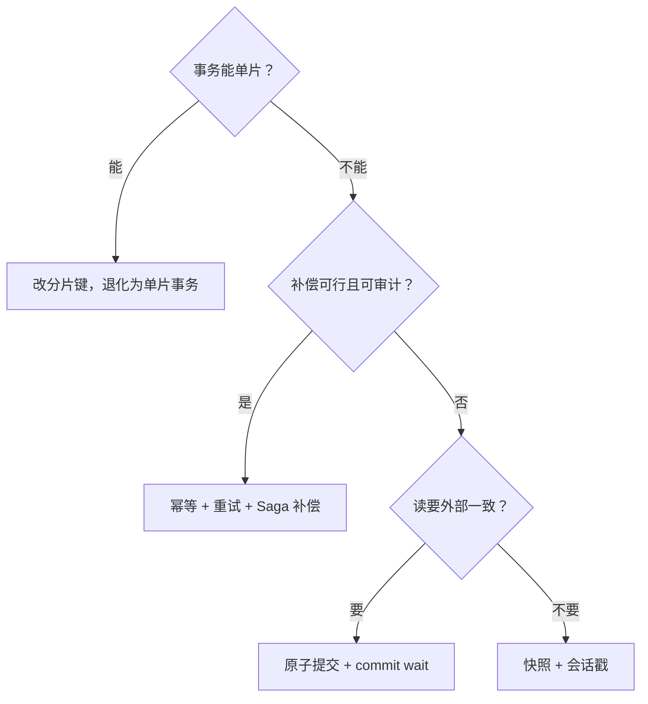

# 分布式事务案例与收束

分布式事务最好的优化常常不是更聪明的协议，而是更少的跨片事务：把数据搬到事务需要在的地方。

<footer>—— 据 Gray and Reuter, Transaction Processing, 1993；本课程六课的协议与体系账</footer>

[上一课](/cs/dt-isolation-implementation)把隔离钉在时间戳与提交点校验上。本课程到此收束：先用三份案例把六课的清单走一遍，再给出「要不要跨片事务」的决策口径。协议课（2PC 实现、Percolator 与 TiDB、Calvin）与体系课（谱系、隔离实现）在此拼成一张部署图。

## 问题

协议都会背，案例里难的从来是选择：哪些操作必须原子，哪些补偿就能过。缺口是**把协议选择翻译回业务约束**：一笔转账要跨片原子；一天一次的对账报表不必；购物车合并不需要快照隔离，库存扣减需要。这一步翻译错一行，选型全错。最常见的错法有两个：把所有跨服务调用都包进「分布式事务」，以及反过来，该原子的地方用重试凑——前者把协议税加在不需要的账上，后者把撕票的风险留给生产环境夜里爆发。

## 方法

案例 A，TiDB 一类：账务负载走悲观模式加 Percolator 主锁，TSO 批量发号；设计分片键把扣减与流水放进同一分片，2PC 退化成单片事务——最好的一次优化是不跨片。案例 B，Spanner 一类：全球一致性场景老实付 commit wait 与跨组 2PC 的税，读走快照时间戳，热点账户按子键拆分避免长锁；隔离档位按上一课的三段账显式声明，不靠默认值。反例 C：把下单、扣库存、调支付三个跨服务步骤包进 2PC 的尝试——正确答案是幂等加重试加补偿（Saga），不是提交协议；[共识与 2PC](/cs/consensus-vs-2pc) 的老口径在这里兑现：原子提交协议管的是存储层同归同败，不管业务补偿的先后与可审计。运维清单四件：挂着不放的 in-doubt 事务要告警；TSO 或发号器要可扩容、可恢复；时钟漂移要监控（TrueTime 系这是生命线）；隔离级别要用一致性测试抽查，而不是信任文档。

把跨服务调用误包进 2PC 的典型结局：数据库都已 prepared、锁挂着，第三方接口却超时了。协议没有错，是用错了层——业务步骤没有「prepared 后必达」的性质，撑不起这份合同。

## 机制

决策口径三问。一问：事务能不能单片？能，就改分片键，任何协议税都省了。二问：失败时补偿是否可行且可审计？可行，用 Saga——每步幂等，失败沿日志逆向补偿；不可行（钱已出账、货已发出），才动原子提交。三问：读要不要新鲜到外部一致？要，付 commit wait 或选严格串行实现；不要，快照加会话戳足够。性能账从第一课继承：税 = 锁持有时间 × 分片数 × 消息轮次，后面每一课的优化各砍一项——async commit 砍轮次，定序免对话，commit wait 用等待换序，单片化直接把乘数清零。没有免费的一项；声称免费的那一项，多半是被挪到了别人头上。

## 边界

本课不排产品名次，不替业务宣布「正确级别」，也不展开队列削峰与最终一致的实现——那是流处理与系统模式的课。再往深走是各系统的论文与源码，不在本课程树内。六课的账各归各位：协议课管提交怎么不撕票，体系课管谱系怎么读，隔离课管级别怎么落地，本课管什么时候根本不该跨片。本课程到此收束。

## 小结

- 选型第一问是「能不能单片」：分片键设计优于一切协议优化。
- 补偿可行用 Saga，不可行才动原子提交；提交协议不管业务补偿。
- 性能税 = 锁持有 × 分片数 × 轮次；各课优化各砍一项，没有免费的一项。
- 运维四件：in-doubt 告警、发号器扩容、时钟漂移监控、隔离级别抽查。
- 出处：Gray and Reuter 1993；Corbett et al. 2012；Thomson et al. 2012；Peng and Dabek 2010。本课程到此收束。
