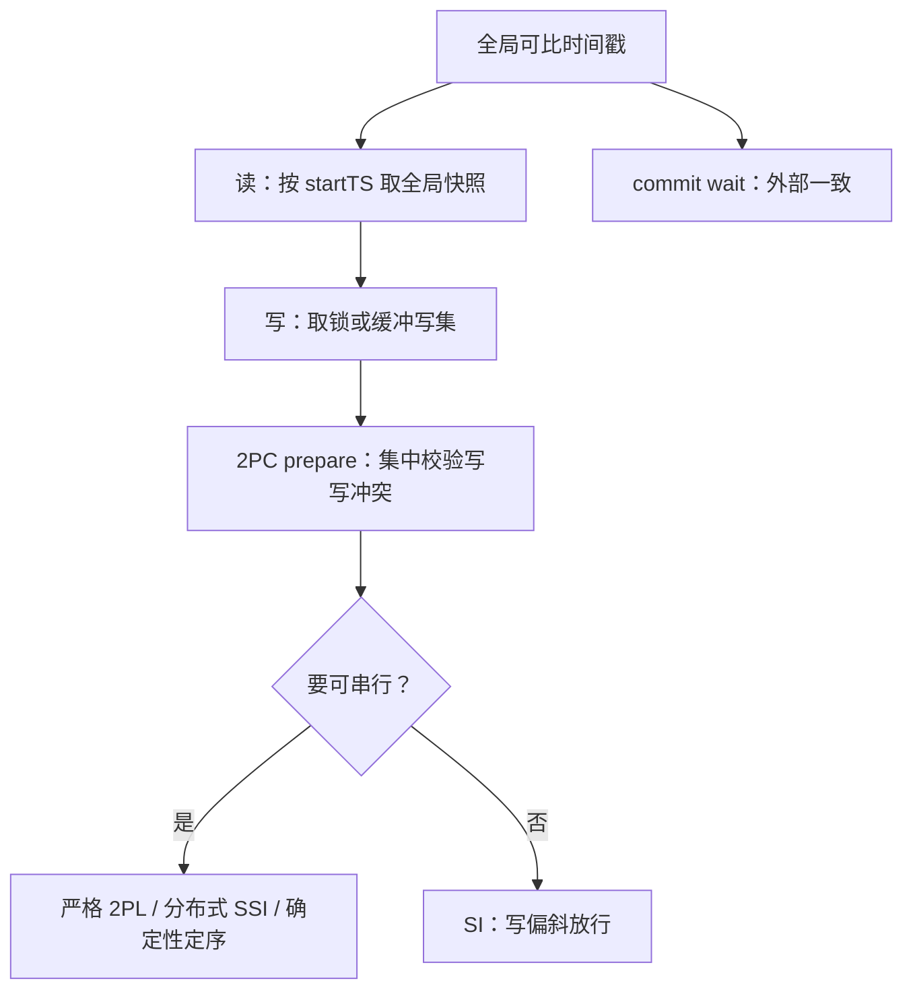

# 隔离级别的实现

分布式下没有「默认可串行」：隔离等于全局可比的时间戳，加上提交点上的集中校验；缺一样，级别表就只是文档。

<footer>—— 据 Berenson et al., A Critique of ANSI SQL Isolation Levels, SIGMOD 1995；Cahill et al., Serializable Isolation for Snapshot Databases, SIGMOD 2008 整理</footer>

[上一课](/cs/dt-newsql-family)把谱系折算成时间戳来源。本课钉最后一块机制：同一张异常表（[隔离级别](/cs/isolation-levels)），在单机 MVCC 上是一条可见性函数，跨片之后变成两件事——全局可比的戳，与提交点上的集中校验。主干课的 [快照隔离](/cs/snapshot-isolation) 给过 startTS 与 commitTS 的单机版；本课补分片之后多出来的账。

## 问题

单机 SI 里，startTS 与 commitTS 由同一个引擎发号，天然可比。分片之后戳各片自报，「更早」失去定义：A 片上的读可能看不到 B 片上更早提交的写——不是可见性函数错了，是「更早」没定义。缺口有二。其一是**全局可比的时间戳**，上一课谱系里的四条路线就是为它而造。其二是**提交点校验**：写写冲突、以及可串行所需的更高档检查，必须在一个原子时刻集中判定。只做前者不做后者，得到的是「每个分片各自 SI」拼起来的系统：每片单独看都守级别，跨片读一遍就出异常，文档上写什么档都挡不住。

## 方法

账分三段。读路径：按 startTS 取全局快照，[MVCC](/cs/mvcc) 的可见性函数原样可用，读不取锁；戳的分发方式（TSO、HLC、TrueTime）决定快照能新鲜到什么程度。写路径：悲观引擎写时取锁（锁在组长内存或数据表里），乐观引擎缓冲写集；[间隙锁与谓词锁](/cs/gap-locks-predicate) 的范围问题在分片上更疼——范围跨片时谓词要拆成各片的键区间，无索引则退化成粗锁再叠网络。提交路径：2PC 的 prepare 阶段兼任校验点——锁在此刻集中，写写冲突在此刻定胜负（第一提交者胜）；这是跨片 2PC 在「原子结局」之外的第二职责，第一课的日志序在这里被复用成校验的串行化点。写偏斜要再高一档：SSI 在单机上靠追踪 rw 反依赖的危险结构（Cahill 等的算法），分布式下这个图跨节点，要么把判定搬进提交点，要么像 Calvin 那样用日志序直接免除——依赖环在定序时就没有机会形成。

SSI 的危险结构检测在单机是内存里的图（Postgres 的实现即如此）；跨片后这个图要跟着 prepare 一起在提交点对账——这也是 Postgres 的 SSI 走不出单机的结构性原因之一，不是没人想移植。

## 机制

把级别折算成实现动作，口径就硬了。读已提交：每语句取一次快照戳。可重复读与 SI：事务级快照加提交点写写校验。可串行：三条实现路——严格 2PL 加分布式死锁处理（[分布式死锁](/cs/distributed-deadlock) 课的账）、分布式 SSI 加跨节点反依赖判定、确定性定序。外部一致（严格可串行）再加一条：提交序与真实时间序一致，那是 commit wait 买来的（[Spanner 与 TrueTime](/cs/spanner-truetime)）。每个动作都有价：快照新鲜度受戳分发延迟限制，follower 读与 stale read 是拿旧快照换延迟的显式旋钮；旋钮拧过头，应用会看不到自己刚写的数据，会话一致性要靠会话戳自己保（[复制延迟与读己之写](/cs/replication-lag-rmw) 的口径）。版本回收也多了跨片一问：老快照被长事务钉住时，GC 要全局协调谁还握着最老的戳（[MVCC 版本回收](/cs/mvcc-gc) 的单机账在此加这一问）。

## 边界

本课不算各实现的性能公式，不重讲单机可见性函数，也不把因果一致性、并行快照划进级别表——那是不要求全序的另一档合同。判据始终是主干那条：先问允许哪些异常，再问校验动作发生在哪个原子时刻；两个答案都对上了，级别名才是可执行的承诺，否则只是厂商的默认值。下一课收束：把六课的协议与体系拼成选型与运维的清单。

## 小结

- 分布式隔离 = 全局可比时间戳 + 提交点集中校验；缺一就只是分片级 SI 的拼盘。
- prepare 阶段兼任校验点：写写冲突在此定胜负，这是跨片 2PC 的第二职责。
- 可串行三条路：分布式 2PL、分布式 SSI、确定性定序；外部一致再加 commit wait。
- 快照新鲜度是显式旋钮：stale read 与 follower 读换延迟，读己之写靠会话戳。
- 出处：Berenson et al. 1995；Cahill et al. 2008；Corbett et al. 2012。
