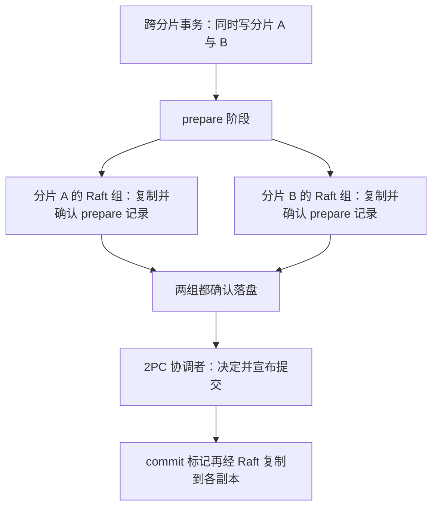
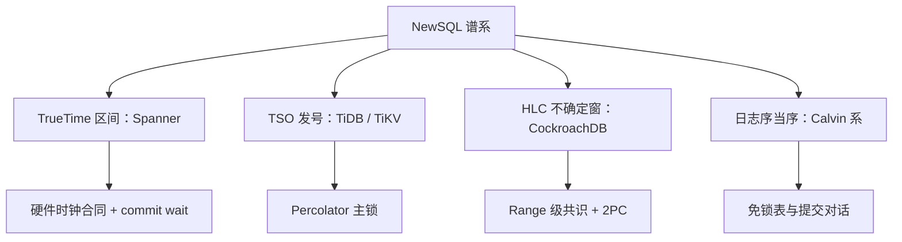

# NewSQL 谱系

NewSQL 不是一种协议，是提交时间戳的四个来源在产品里的分岔：真时钟区间、中心发号、混合逻辑钟、确定性日志。

<footer>—— 据 Pavlo and Aslett, What's Really New with NewSQL?, SIGMOD Record 2016；本课程前三课的协议账</footer>

[上一课](/cs/dt-calvin-deterministic)用日志序把提交对话整块免掉，加上此前的 2PC 日志序与 Percolator 主锁，协议课的账钉完了。主干课的 [NewSQL](/cs/newsql) 给过「四问读系统」的清单；本课是谱系课，用这份清单给产品族排座次——各家真正分岔的位置只有一个：跨片事务的提交点与时间戳放在哪。后两课在这张谱系图上收束隔离与选型。

## 问题

「NewSQL」标的是承诺——SQL、强一致、自动分片——不是机制。缺口是**把商标翻译回协议**，不翻译就没法比较：CockroachDB 拿不到 Google 的原子钟，用混合逻辑钟近似 TrueTime，读碰到不确定区间就重启事务；TiDB 沿 Percolator 路线，把 TSO 放进 PD，SQL 层与 KV 层拆开部署；FaunaDB 一类沿 Calvin 路线；VoltDB 干脆按分区串行执行，跨分区事务让存储过程显式处理。延迟数字里的差距，很多时候不是工程优劣，是协议税不同——翻译不出协议，基准测试就没有可比性，选型就变成比谁的宣传页厚。

## 方法

谱系按三个轴读。轴一，提交时间戳从哪来：TrueTime 区间（Spanner，硬件合同）、TSO 中心发号（TiDB，多一跳 RPC、发号器要扩容）、HLC 混合逻辑钟（CockroachDB，无硬件依赖，不确定窗靠协议消化）、日志位置当序（Calvin 系，干脆取消时间戳）。轴二，锁住哪：组长内存（Spanner）、数据表（Percolator 系）、键序定序（Calvin 系）。轴三，部署形状：TiDB 是无状态 SQL 节点加 TiKV 加 PD 的三层；CockroachDB 是单一二进制，Range 为单位组 Raft，底层 LSM 引擎 Pebble。公约数也看得清：所有系统都用共识复制每个分片，2PC 只出现在跨分片提交点上——「共识管复制、2PC 管提交」的分工是全谱系的公约数，[共识与 2PC](/cs/consensus-vs-2pc) 的口径在这里兑现成产品结构。

CockroachDB 的读不确定区间：读到的值其时间戳落在自己的不确定窗内，就整体重启事务换新时间戳——用重试代替原子钟；混合逻辑钟的文献锚点是 Kulkarni 等人 2014 年的 Logical Physical Clocks。

TSO（Timestamp Oracle）直译是「时间戳神谕」：全集群只有它一个发号器，任何事务要戳都得问它一趟。好处是戳绝对全局可比，坏处是它是中心依赖——所以运维清单里 TiDB 的 PD 要可扩容、可恢复：发号器一挂，全库写事务都得停摆。

HLC 可以类比「手表加排队叫号」：平时看物理钟走，一旦发现别的节点手里的号比自己大，就把自己的号推到比它大一点——逻辑部分专门兜住时钟不同步。代价是读到落在自己「不确定窗」内的数据时只能整个事务重来，CockroachDB 是拿重试次数换原子钟的钱。

## 机制

为什么分岔点是时间戳：快照读要求全局可比的读时间，写提交要求全局可比的提交序——下一课要钉的「隔离 = 可比戳加提交点校验」，前一半正是它的产物。四种来源就是四种把「全局序」造出来的办法，各付各的税：TrueTime 付硬件与 commit wait；TSO 付一跳 RPC 与发号器可用性；HLC 付不确定窗与读重启；确定性付访问集预知与批处理延迟。看穿这一点，产品手册里「跨地域强一致」的宣传都能折算成四者之一再加一个距离税：跨地域的每次提交至少付一次广域往返，问题只是这笔钱付在哪一步、由谁看见。

距离税代个数：光在光纤里每毫秒走约 200 公里，北京到美东单向就要 50 毫秒往上，一次广域往返轻松到 150 毫秒量级。Spanner 的 commit wait 约 7 毫秒看着不大，跨洲部署时真正的大头在往返距离上——这部分谁家的协议都免不掉。

## 边界

本课不做产品排名，不展开分片中间件（Vitess 一类）的 XA 细节，也不把 Aurora 这类「存储服务化」硬塞进谱系——它的单写者模型把跨片提交问题整个绕开，是另一条路，口径归 [存算分离](/cs/storage-compute-separation)。存储引擎内部 LSM 与 B+ 的账归存储课。下一课单独钉「隔离级别在分布式下怎么实现」：谱系里的四种时间戳来源，如何变成用户看得见的异常表。

## 小结

- NewSQL 的承诺是 SQL 加强一致加分片；机制分岔在提交时间戳来源与锁的位置。
- 谱系四条：TrueTime 区间、TSO 发号、HLC 不确定窗、确定性日志，各付各的税。
- 公约数是「共识管复制、2PC 管跨片提交」；分歧是提交点放哪、时间税付在哪一步。
- 读白皮书先翻译协议再谈数字：延迟差距里含协议税，不全是工程优劣。
- 出处：Pavlo and Aslett, SIGMOD Record 2016；Corbett et al. 2012；Thomson et al. 2012；Kulkarni et al. 2014。
