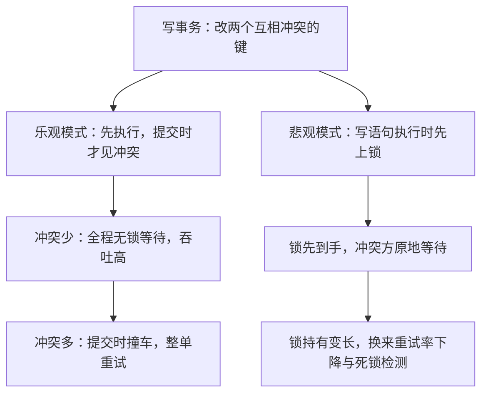
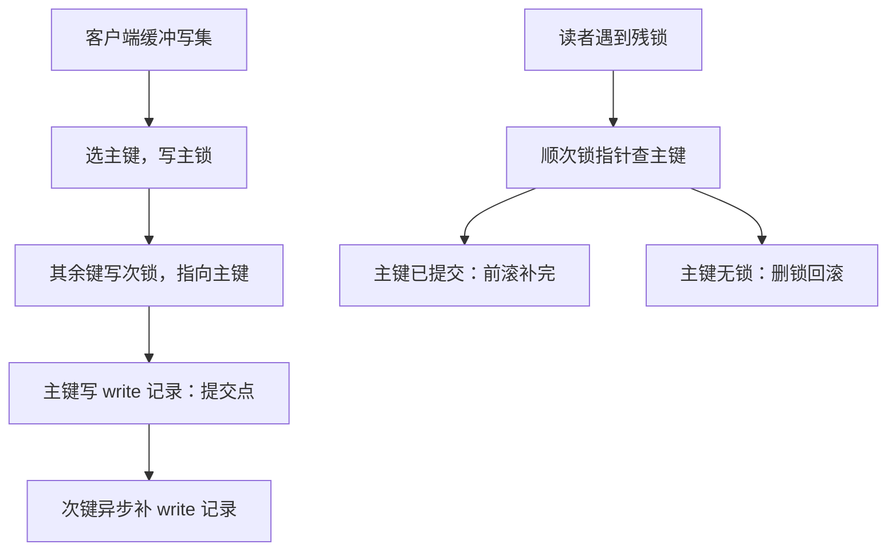

# Percolator 与 TiDB 案例

把 2PC 的状态机塞进数据表，协调者的崩溃就从一个进程故障，变成一行残留锁的清理问题。

<footer>—— 据 Peng and Dabek, Large-scale Incremental Processing Using Distributed Transactions and Notifications, OSDI 2010；TiKV 事务模型文档整理</footer>

[上一课](/cs/dt-2pc-implementation)把 2PC 的账钉在日志序与不确定窗口上。本课看两份把这套账搬进 KV 的实现：主干课的 [Percolator](/cs/percolator) 给过 lock/write/data 三列的外观，本课补两处它没展开的细节——提交点为什么必须落在主锁上、崩溃后谁有权收拾——再看 TiDB 怎么把这套为增量处理设计的协议改造成 OLTP 引擎的底座。

## 问题

Percolator 没有独立协调者进程：2PC 的状态就是表里的行。客户端缓冲写集，提交时选一个键作主锁，其余键的次锁都指向它。缺口有二。其一是**崩溃后的判定权**：读者在快照时间之后看到一把残锁，要顺次锁指针查主锁——主锁行已变成 write 记录则前滚（替它补完清理），主锁不在则回滚（删掉残锁）。这个判定不依赖任何进程活着，是「状态在数据里」换来的性质。其二是**延迟**：每次读要查 lock 列，每次提交要多次 KV RPC 加两次取戳；主干课说过它只配增量作业。TiDB 要拿它当 OLTP 底座，账必须重算。

## 方法

TiKV 承袭 Percolator 的账，改动都在税目上。取戳：PD 充当 TSO 全局发号，客户端一次批量预取一段号，用本地递增消化单个事务的两次取戳，把发号 RPC 从每次提交里摊薄出去。读：在 startTS 下检查键上有没有 $ts \lt \mathrm{startTS}$ 仍未清的锁——有则退避重试或主动 resolve。写路径有两种脾气：乐观模式沿 Percolator 原样，提交才见冲突、冲突即整单重试；悲观模式（TiDB 后来加入并把 OLTP 场景的默认切了过去）在写语句执行时先上锁，把冲突处理挪进写路径——等待与 [分布式死锁](/cs/distributed-deadlock) 那课的跨节点等待图随之而来，锁持有变长，换来的是重试率下降。

固定税目：一次提交至少两次 TSO 往返（startTS 与 commitTS），加上每个键锁、数据、写记录的多次 KV 写。Percolator 论文自述这套延迟只配增量作业——TiDB 的全部工程化，都是在给这句话翻案。

「乐观／悲观」的名字说的是对冲突的预期：乐观模式赌冲突罕见，先干活后对账，撞车了整单重来；悲观模式赌冲突频繁，先占坑再干活。选错脾气的代价很直观——热点行上跑乐观事务，重试率会随并发往上翻着涨，这正是 TiDB 把 OLTP 默认切成悲观模式的原因。

## 机制

为什么主锁落定即全局提交：任何读者读到数据都要沿 write 列回溯版本，而 write 记录只有在锁清掉之后才可见；主锁行的 write 记录是唯一真相源，次键的清理因此可以乱序、异步、无限重试——「补写一条 write 记录」这个动作幂等，做多少遍结果一样。Async commit 与 1PC 这类优化砍的是轮次：小事务的所有键一次写完，或让提交戳由主锁所在 Raft 组的日志序近似给出，省掉与 TSO 的第二次往返；代价是恢复协议更复杂，崩溃时要知道「这个事务曾打算用什么戳」。工程边界也在这里：单事务键数太多时，次锁清理变成清理风暴；超长事务把读者的退避拖成雪崩。Percolator 系协议的失败模式几乎都落在这两处。

前滚／回滚可以类比接手一个弃工的现场：主锁行的 write 记录相当于「竣工验收单」，有单说明活干完了，接手者只需替各分项补齐验收单（补 write 记录）；没单就拆掉残锁重新来。补单做多少遍结果都一样——这就是幂等，也是清理可以无限重试的底气。

## 边界

本课不算 Raft 与 Region 的内部账（共识课与存储课负责），也不把 Percolator 路线说成唯一解——下一课的 Calvin 连锁表都不要。与 Spanner 一句话对照：Spanner 的锁挂在组长内存里，崩溃恢复走共识组；Percolator 的锁躺在数据行里，崩溃恢复靠读者顺手清理。前者恢复快、实现厚；后者实现薄、读路径多一跳查锁。

为什么长事务在这里格外危险，代个数：事务持锁 10 秒，期间每个想读这行的新读者都要退避重试；若每秒来 100 个读者，10 秒就是上千次无效重试，队列越压越厚——「退避拖成雪崩」就是这么成型的。所以 Percolator 系的运维纪律是：严控事务时长的上限。

## 小结

- Percolator 的 2PC 没有协调者进程：主锁即提交点，次锁指向主锁，状态全在数据里。
- 崩溃判定权交给「查主键」：已提交则前滚，无主锁则回滚，动作幂等。
- TiDB 的改造在税目上：TSO 批量发号、悲观模式把冲突处理挪进写路径。
- 优化方向是砍轮次（async commit、1PC）；失败模式集中在长事务与清理风暴。
- 出处：Peng and Dabek, OSDI 2010；TiDB/TiKV 事务模型文档口径。
