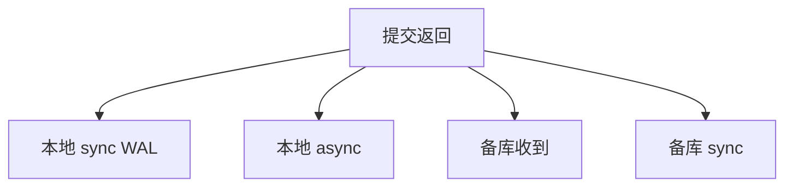

# 持久性等级

D 不是布尔：同步刷本地日志、异步返回、等备库落盘，对应不同的丢失窗口。合同要写 RPO，不能只写 ACID 的 D。

<footer>—— 据 Gray and Reuter；HA 与复制实践；主干 ACID 的 D 分级</footer>

[上一课](/cs/group-commit)摊了 fsync。本课把「刷到什么程度算提交成功」分级。主干 ACID 把 D 当日志持久。工程上异步提交、内存队列、只等备库中的一条，都在卖延迟。缺口是**显式 RPO**（恢复点目标），RTO 下一课谈时间。

## 问题

等级例子：① 本地 WAL sync（默认 D）；② 本地 WAL 异步（崩溃丢一组）；③ 同步复制到备库内存；④ 备库也 fsync。每一档延迟与丢失窗口不同。缺口不是道德指责「假持久」，而是应用与库的合同必须一致：支付系统与点赞计数不是同一档。

组提交在每一档内部仍可做。半同步后课是③/④ 的一种产品形态。

RPO=0 意味同步持久到约定故障域。电池后备的磁盘缓存使 fsync 语义变糊，合同要包含控制器。本课不测硬件。

## 方法

会话或事务设耐久级别。返回成功则按该级保证。降级：备库断开时从④退到①并告警，还是拒绝写入——策略。只读不涉及 D。

与 TDE：未刷的明文缓冲被偷是另一威胁模型，不单是崩溃。

## 机制

崩溃恢复：① 丢未刷；② 丢更多；③ 主挂备升可能丢或用共识避免双主。双主脑裂是复制课。基准：TPC-C 规定耐久，关 fsync 的数字不能比。

应用重试：异步提交下「成功返回」仍可能丢失，幂等要按更弱合同设计——与网络课幂等衔接，这里点名。

## 边界

本课不计算 RTO 分钟数。也不把云多 AZ 的每一家 SLA 抄进来。备份 PITR 是另一时间轴。

后课默认：D 有等级；默认教学仍是本地 sync WAL。RTO 与恢复：从崩溃到可服务的时间，检查点与 redo 速度决定。

没有写明的 D，基准与事故复盘都无法谈丢失窗口。

## 小结

- 持久性从本地 sync 到跨机 sync 分档，对应 RPO。
- 降级策略要显式；基准必须声明档位。
- RTO 与恢复下一课。
- 出处：Gray and Reuter；复制 HA 实践。
