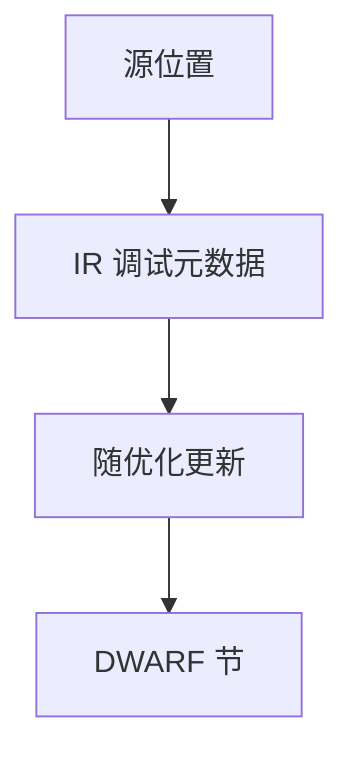

# 调试信息 DWARF

优化把值放进寄存器并删语句，源级调试靠 DWARF：行号表、位置列表、类型 DIE。信息必须随变换更新，否则断点落空。

<footer>—— 据 DWARF 标准；Tichy 等调试优化代码的讨论；主干编译器通行证整理</footer>

上一课[unwind](/cs/stack-unwinding)用了 DWARF CFI。缺口是**源级调试**：哪一行、变量现在哪、类型布局。优化编译器要么保守少优化，要么发复杂 location list。本课钉 DIE 与行表，不写 GDB 协议。符号 mangling 下一课。

## 问题

DCE 删赋值，变量「当前无位置」。内联：同一源行多个实例，需 `DW_TAG_inlined_subroutine`。缺口是**元数据与 IR 同步**，不是 FDE 查找。

行号：`is_stmt` 标记语句边界，方便断点。调度打乱序，行表可非单调。

### DWARF 不是「关掉优化」

`-O2 -g` 合法：信息尽量描述优化后的机器。质量参差。不要假设 `x` 总在栈槽。

DWARF 5。GCC/LLVM 的 DI 元数据。本课不把 CodeView 写完，只点名 MSVC 另一格式。

## 方法

前端发 `dbg.value`/`dbg.declare`。优化传递：复制、删除时更新。后端：寄存器分配后写成 location list（按 PC 区间）。类型：从语言类型降到 DIE。

与 SROA：字段拆开要多个 location。与合并：两变量同寄存器，调试器按 PC 区分。

## 机制

体积：`-g` 显著增大。分离：`.dwo`/dsym。strip 后只留 unwind 或全无。不要把密钥写进调试字符串。

ASan 改变布局，调试信息要跟。

## 边界

本课不写表达式求值器全部 DWARF ops。后课默认：优化代码用位置列表。下一课符号与 mangling：链接与调试都看见的名字。

也不把 DWARF 当核心转储格式的全部（ELF note 另有）。

## 小结

- DWARF：行号、类型、变量位置，随优化更新。
- 内联与 SSA 析构是主要难点。
- CFI 是 DWARF 的一部分，服务展开。
- 出处：DWARF 标准；对照 Appel/龙书调试支持。
