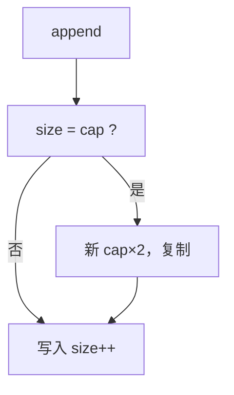

# 动态数组扩容

长度未知时先留容量；满了就换一块更大的连续区并复制。单次可以线性，一串插入仍可平均常数——账在后课摊还里结。

<footer>—— 据 Cormen, Leiserson, Rivest and Stein, Introduction to Algorithms 第 17.4 节；Knuth, TAOCP 卷 1 整理</footer>

[上一课](/cs/array-random-access)把按下标读写做成 $\Theta(1)$，长度事先已知。真实序列会在尾部增长。本课不重讲基址加偏移。缺口是容量与长度分离：`size` 个已用槽、`cap` 个已分配槽；满则分配更大块、复制、释放旧块。本课只钉倍增这一表示，不把势能函数写完。

## 问题

定长数组的合同没有 `append`。每次增长 1 就 `realloc` 到 $n+1$ 并复制，则 $n$ 次 append 总代价 $\Theta(n^2)$。缺口不是链表——随机访问还要保住——而是**几何增长：`cap` 乘以常数 $\ge 2$**，使得复制次数稀疏。

缩小可在 `size` 远小于 `cap` 时折半，避免只增不减的泄漏。本课点名，细节与摊还同一套账。

CLRS 用「表扩张」作摊还的主例。本课先有对象；[摊还分析](/cs/amortized-analysis)在队列与环形缓冲之后才给分析方法。

## 方法

表示：指针、`size`、`cap`。`append`：若 `size=cap`，申请约 $2\cdot\mathrm{cap}$ 的新数组（空表从常数起），复制 `size` 个元素，替换指针。然后在 `size` 处写入，`size++`。按下标仍 $\Theta(1)$，中间插入仍 $\Theta(n)$ 搬移。

迭代器/指针在扩容后失效：基址变了。合同必须写明，否则调用方握着旧地址。

## 机制

随机访问与空间局部性与定长数组相同，直到发生复制：那一次扫完全表，cache 友好但停顿明显。实时路径若不能接受峰值，应预留 `cap` 或改用链表。几何因子太接近 1，复制过频；太大则浪费内存。2 是常见折中。

与[局部性原理](/cs/locality-principle)：新块可能在堆的另一处，NUMA 上甚至换节点；地址计算仍是乘加，延迟不是渐近记号里的 $O(1)$ 纳秒。

## 边界

本课不用合计或势能证明摊还 $\Theta(1)$，只陈述「复制足够稀」。也不引入分块数组（deque 的块列）——那是后课为两端生长准备的。链表用来买中间插入，不在本课替换动态数组。

后课默认：尾部增长的连续表用动态数组；按下标仍 $\Theta(1)$，扩容时指针失效。中间插入的局部性对照下一课链表。

## 小结

- `size` 与 `cap` 分离；满则几何扩容并复制。
- 保住随机访问；扩容使旧指针失效。
- 摊还证明后置；链表下一课付插入与局部性的另一笔价。
- 出处：Cormen et al. 表扩张；Knuth, *TAOCP* 卷 1。
