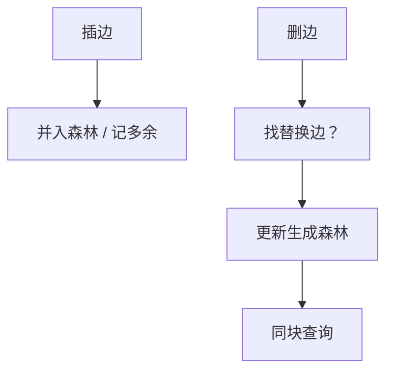

# 动态连通性

边插入、删除时维护「是否同连通块」：插入用并查集；删除要树分解或 Euler Tour，均摊近对数。

<footer>—— 据 Holm, de Lichtenberg and Thorup, Poly-Logarithmic Deterministic Fully-Dynamic Algorithms for Connectivity, 2001；并查集见 CLRS 第 21 章整理</footer>

上一课[收缩层次](/cs/contraction-hierarchies)预处理静态最短路。本课图在变：无向连通性的充分动态（插边+删边）。主干[并查集](/cs/union-find)只合并、不拆。缺口是删边后如何重连。不重写路径压缩。后课流式模型：图自己也看不完。

## 问题

半动态：只有插入（并查集），或只有删除（离线可重构）。充分动态：交错插删。离线删边：按时间倒过来变成插入。在线删边：维护生成森林；删树边后在「替换边」候选里找，或分层：每层生成森林，删边到下一层找替换（Holm 等）。均摊 $O(\log^2 n)$ 量级。

缺口是替换边，不是再 DFS 全图——那是 $O(n)$ 每次。

### 生成树不是 MST 动态

连通性不需要权。动态 MST 更难（权更新）。本课只 0-1 连通。2-边连通、动态平面性另论。

Holm–de Lichtenberg–Thorup 2001 确定性多对数。Euler Tour Tree 维护森林连通与子树。Sleator–Tarjan LCT 也可切边。后课图流：空间 $o(n)$，连森林都存不下。

## 方法

插入非树边：记为多余边。删非树边：直接丢。删树边：在覆盖该切分的非树边里找，或降层。查询 `find` 是否同一树根。

离线：时间倒流 + 并查集最简单。

## 机制

切分 $(A,B)$ 的替换边即跨 $A$、$B$ 的剩余边。分层把边按「被当作树边的级别」限制扫描范围，均摊对数层。与点分治：这里动态，切的是边生命周期。不要用 CH 捷边当动态连通：对象是最短路不是 0-1。

## 边界

本课不写最优单元代价下界全文（有条件下界）。有向图动态强连通更难。后课默认：插边并查集；充分动态用分层森林或 LCT。下一课图流与半流：内存读一遍。

## 小结

- 插入易、删除要替换边或离线倒流。
- 充分动态可达多对数均摊。
- 只问连通，不是动态最短路。
- 出处：Holm, de Lichtenberg and Thorup, 2001；CLRS 并查集。
