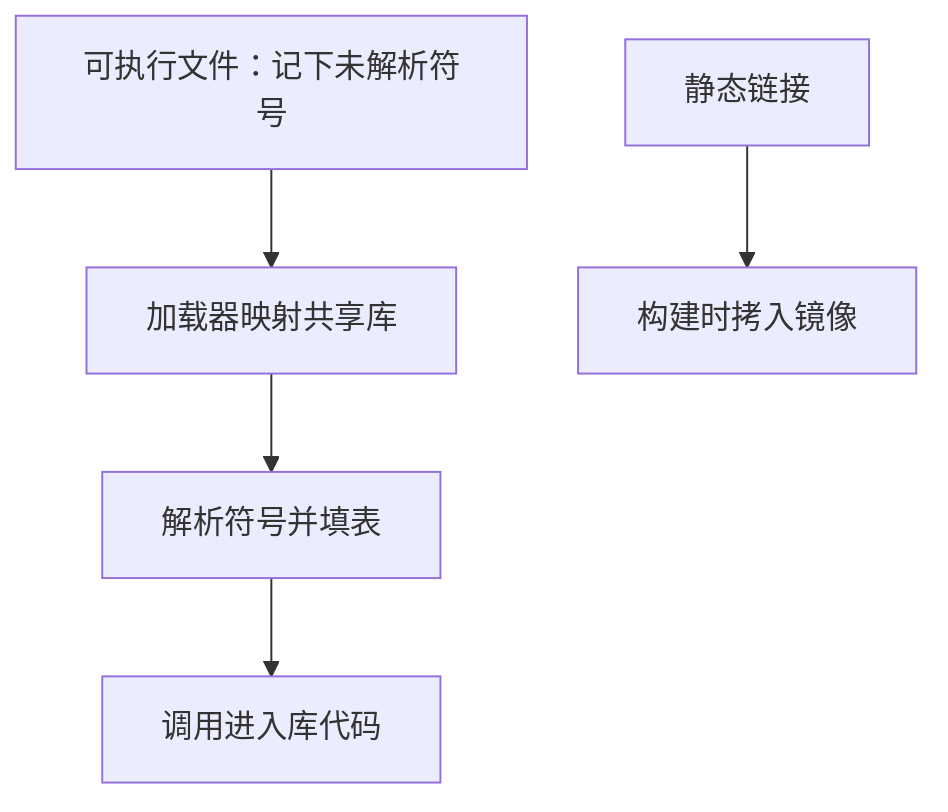

# 动态链接直觉

静态链接在构建时把库代码拷进镜像；动态链接只记下符号，把真正的地址留到加载或第一次调用再填。

<footer>—— 据 Bryant and O'Hallaron, Computer Systems: A Programmer's Perspective 第 7 章；ISO/IEC 9899 整理</footer>

上一课[构建系统](/cs/build-system)把链接画成图上的一步，产出一份可执行文件。本课不重讲 Make，也不从 ELF 节区名表另起。缺口是：第一课已经点名动态链接，**为何可执行文件里可以没有 `printf` 的指令，运行时却能跳进去**。共享库把「解析符号」从构建推迟到进程启动之后。

## 问题

静态链接把用到的目标拷进镜像，地址在构建时钉死，发布简单，镜像大，库的安全修复要重新链接各程序。动态链接让许多进程映射同一份库代码，可执行文件只保留对外部符号的重定位记录。缺口因此不是「DLL 好不好」，而是**两阶段解析**：构建时确认符号存在（或允许未定义到加载时），加载器把库映进地址空间后写回真实地址。调用约定仍然有效，只是第一次间接可能多跳一次。

缺库、库版本与构建时看到的符号集不一致，会在启动或首次调用时失败，而不是在构建图的链接节点失败。这是构建系统漏掉的一类边：运行时依赖。版本课里的「可回放」对动态库更脆，必须连同库版本一起记录。

### 动态链接不是「运行时编译」

加载器做的是映射与重定位，不是把 C 再编译一遍。符号查找按约定的搜索路径与顺序，可能解析到你没打算用的那一份同名库。把动态链接理解成解释执行，会与后课系统调用、地址空间搞混。JIT 是另一回事，本栏不写。

CSAPP 第 7 章用过程链接表与全局偏移表说明：调用先跳到一段可写槽，第一次解析后改写成直接跳转。ISO C 仍把程序看成链接后的整体；动态库是实现把「整体」推迟拼完。

## 方法

构建时对共享库做未完成的重定位：代码里对外部函数的调用走进过程链接表（PLT），数据引用走进全局偏移表（GOT）。加载时，动态链接器按依赖列表映射库，解析符号，填充 GOT。惰性绑定把函数符号的解析推迟到首次调用，以加快启动。`dlopen` 一类接口让解析发生在 `main` 之后，本课只点名。

位置无关代码让同一库能映到不同进程的不同基址。这为后课地址空间随机化做准备，本课只需要：库内的地址也是相对的，加载后再定。

构建时用的共享库与运行时搜到的库可以不是同一文件：`rpath`、`LD_LIBRARY_PATH` 与系统默认路径组成搜索顺序。这是第一课「链接解析符号」在时间上的延长。静态链接没有这条搜索，镜像自足，但也失去了不重链就能打补丁的能力。两种模型可以在同一进程里混合：可执行文件静态链一部分，再动态依赖 libc。后课系统调用仍从 libc 包装进去，与这份库从哪来无关——陷入的是内核，不是 `.so` 文件本身。

## 机制

间接表让代码段可以只读共享：各进程私有的是 GOT 里的地址，不是整份指令。第一次调用的额外跳转是启动与热路径之间的折中。符号冲突（两份库提供同名强符号）按搜索顺序决胜，症状可以是「调用进了错误实现」，类型系统帮不上忙——又一次，链接器看名字不看 C 类型。

位置无关代码让库能被映到随机基址：指令用相对寻址，绝对地址只出现在可写的 GOT 里。这与后课地址空间一览直接衔接——同一库在两进程里的虚地址可以不同，物理页仍可共享只读代码。惰性绑定把首次调用变成「解析再跳转」，多线程下需要绑定过程自身的同步，那是实现细节。符号版本让同一名字在库演进后仍能绑到旧实现；没有版本时，升级库等于默默改所有已构建程序的契约。这比静态链接更需要把库版本写进部署记录。

## 边界

本课不画完整 ELF 重定位类型，不讲符号版本脚本的全部语义。下一课[系统调用作为边界](/cs/syscall-as-boundary)把控制从用户代码再送出一次，对象换成内核。后课默认：动态库在加载或首次调用时完成符号解析；可执行文件可以不含库的指令；运行时搜索路径是契约的一部分。

未定义符号若延迟到加载时才报，构建图的链接节点会绿、进程启动才红。把运行时依赖写进清单，与源一同版本管理，回放才包含库。静态链接没有这条时间差，代价是镜像更大、补丁要重链。

## 小结

- 动态链接推迟符号解析；静态链接在构建时拷贝代码。
- PLT/GOT 用一次间接换来只读共享的代码段。
- 库版本与搜索路径是构建图之外的依赖。
- 下一课穿过用户与内核的边界。
- 出处：CSAPP 第 7 章；ISO C 的程序仍视为链接后的整体。
