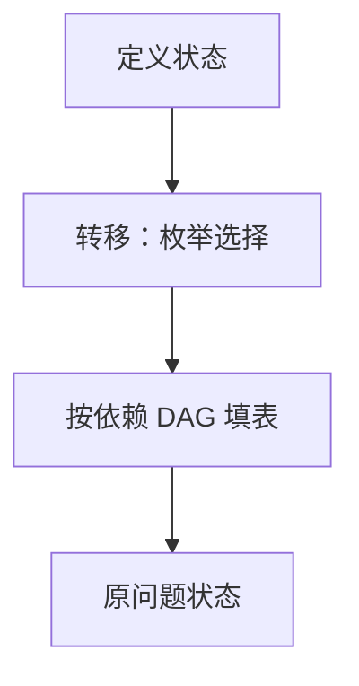

# 动态规划

最优子结构加上重叠子问题：把子答案制成表，每个状态只算一次。

<footer>—— 据 Bellman, Dynamic Programming, 1957；CLRS 第 15 章整理</footer>

上一课[交换论证](/cs/exchange-argument)要求证明「只走一条局部选择」。本课不重做交换论证。缺口是：最优子结构仍在，但**哪一条选择对事先不知道**，且同一子问题被多次引用。分治若直接递归会指数爆炸。本课钉 DP：状态、转移、填表或备忘。Floyd 已是实例，这里抽象出来。

## 问题

钢条切割、最长公共子序列：最优解包含某子问题的最优解，但切点或对齐位置有多种，必须都试。朴素递归树里 $T(i)$ 与 $T(j)$ 反复出现。缺口不是再发明递归，而是**用空间换重复计算**：每个状态 $\Theta(1)$ 或多项式次转移。

与分治对照：分治子问题几乎不交；DP 故意交。与贪心对照：贪心省掉除一条以外的转移。三者都要最优子结构；只有 DP 默认枚举。

### 状态不是「再开一个数组」

先定义「子问题是什么」（前缀、区间、到顶点 $v$ 且用了 $k$ 条边）。再写转移。没有状态就没有表。本课不把背包容量细节写完，那是下一课；这里用钢条或 LCS 当骨架。

Bellman 1957 的「最优化原理」即最优子结构。CLRS 第 15 章用备忘与自底向上对照。本课两者都承认：拓扑序填表 = 带缓存的递归。

## 方法

定义状态 $dp[\cdot]$。写出边界与转移（$\min$ 或 $\max$ 若干更小状态）。证明每个状态依赖的规模更小，故 DAG 上可算——[DAG](/cs/dag-repr) 与[拓扑](/cs/topo-sort)在这里变成填表序。复杂度 = 状态数 $\times$ 转移代价。

重建解要存前驱选择，不只存数值。本课点名。

## 机制

时间多项式当状态多项式。指数状态（子集 DP 的 $2^n$）仍可能有用，但是否在 P 要另说——[P 与 NP](/cs/p-vs-np) 才划分。本课算法课内默认多项式状态的例子。

Floyd 的 $k,i,j$ 是三维状态；最短路的「按边数」是 Bellman–Ford 的 DP 读法。本课把它们收进同一句话，不再各写一章定义。

## 边界

没有最优子结构就不要 DP（有环最长简单路）。没有重叠则备忘无收益，退回分治。贪心若已证，DP 仍正确但更慢。本课不引入凸优化加速。

后课默认：DP = 状态 + 转移 + 填表。0-1 与完全背包是下一课把容量做成状态的实例。

## 小结

- DP 用于最优子结构 + 重叠子问题；枚举选择并缓存。
- 填表序是子问题 DAG 的拓扑。
- 贪心是「可证只留一条转移」的特例。
- 出处：Bellman, 1957；CLRS 第 15 章。
