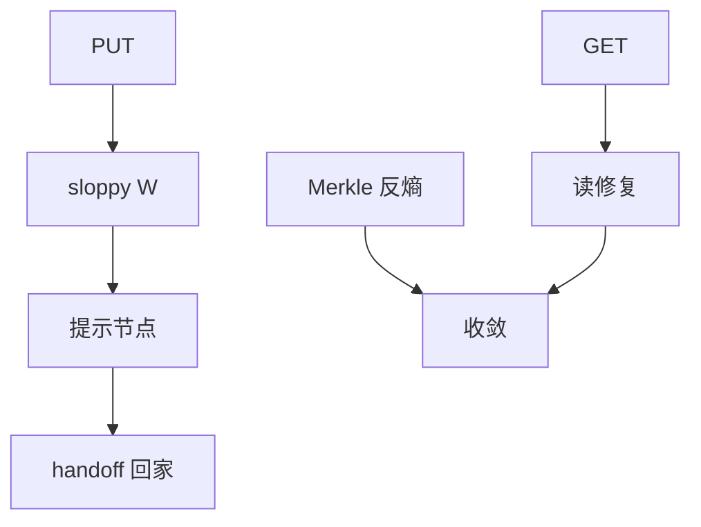

# Dynamo 与反熵

始终可写：斜向法定人数把字节先落到提示节点，再用 Merkle 反熵与读修复把分叉收回来。

<footer>—— 据 DeCandia et al., Dynamo: Amazon's Highly Available Key-value Store, SOSP 2007 整理</footer>

上一课[Quorum](/cs/quorum-rw)的严格相交在分区下会拒绝写。Dynamo 选[PACELC](/cs/cap-pacelc)的 A 与 L。缺口是**提示移交与修复**：写没到「该在的」副本时，系统如何还不丢、如何终收敛。本课不重写 $R+W>n$ 的证明。后课 LWW 是收敛时的一种打结。

## 问题

一致性哈希环上每个键 $N$ 个偏好节点。协调者写 $W$ 个、读 $R$ 个。节点失败时 **sloppy quorum**：写进环上后面的活节点，并记 hinted handoff，对方回来再推。偏好集暂时不相交，线性一致放弃。缺口：愈合后如何发现不一致——不能靠全量扫描每次。

反熵：副本两两比较键的摘要。Merkle 树让子树哈希不同才下降，带宽随差异量而不是全量。读修复：读时发现版本分叉，把合并结果写回。二者一起逼近[最终一致](/cs/eventual-consistency)的收敛。

SOSP 2007 论文把 N/R/W、向量时钟、sloppy、Merkle、gossip 成员放在同一系统里。本课抓反熵与提示，成员 gossip 点名。

## 方法

写路径：协调者（可以是负载均衡选的任意节点）向偏好节点并行写，凑满 $W$（含提示）。读路径：凑 $R$，比版本。后台：反熵会话、提示重放、节点上环后的数据迁入。

成员变化用 gossip，不必每次写先跑共识配置——这与链式复制的配置主相反。

## 机制

向量时钟标并发写：不可比则保留多版本交给应用（购物车合并）。单时间戳 LWW 会静默丢一边——下一课专门钉这个坑。$R=1,W=1$ 延迟最低，分叉最多；$R=W=2,N=3$ 是常见折中，仍不是 ABD。

反熵不是立即：窗口内读可旧。运维看到的「不一致」是时间与故障的函数。Merkle 树深度与键分区粒度影响比较轮次；树本身要与哈希环分段对齐，否则比较的不是同一键集。

本课不把 Cassandra/Riak 当新定理，它们是 Dynamo 论文的后裔。也不把对象存储的跨 AZ 异步复制写成 hinted handoff。

## 边界

本课不写 CRDT 半格，不展开一致性哈希虚节点（数据结构课已有）。后课默认：AP 键值 = sloppy + 版本 + 反熵；严格相交的寄存器不要冒充 Dynamo。冲突如何自动消掉是 LWW 与 CRDT 的分界。

始终可写把安全债务推到愈合。债务用版本与反熵还，不用 CAP 口号还。

## 小结

- Sloppy quorum 与提示移交换可用性，放弃读写相交。
- Merkle 反熵与读修复驱动收敛。
- 并发写靠版本向量检出，合并规则另课。
- 出处：DeCandia et al., SOSP 2007。
