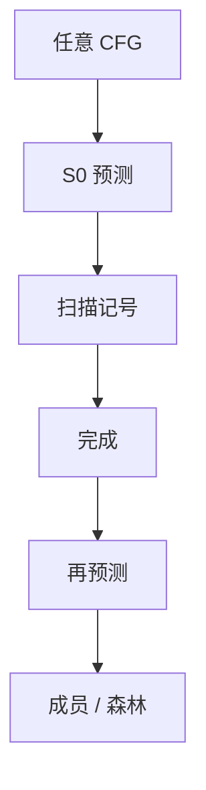

# Earley 解析

每一输入位置一张项集：预测、扫描、完成三步推进；任意 CFG 可在立方时间内判定成员，无二义时接近线性。

<footer>—— 据 Earley, An Efficient Context-Free Parsing Algorithm, 1970；龙书对一般 CFG 分析的对照整理</footer>

上一课[yacc / bison](/cs/yacc-bison)要求文法落进 LALR，冲突靠改写或 `%left`。主干[CYK](/cs/cyk-parsing)已证明一般 CFL 可判定，但要 Chomsky 范式。缺口是**不改写文法**的通用分析：Earley 项在原 CFG 上跑，认左递归、认 ε，也认 yacc 拒掉的形状。本课钉项与三步，不把 marpa 实现写完。

## 问题

LALR 失败时人改文法，语义动作跟着碎。Earley：项 $[A\to\alpha\cdot\beta,\,j]$ 挂在位置 $i$，表示 $A\to\alpha\beta$ 从 $j$ 开始，已吃到 $i$。预测：点后非终结符则加入其产生式；扫描：点后终结符与当前记号匹配则前进；完成：点到末尾，把等待该非终结符的项推进。缺口是这套动态规划，不是再造 LALR 表。

复杂度：一般 $O(n^3)$，无二义 $O(n^2)$，确定（近似 LR）可近线性。比 CYK 省 CNF 化；比 bison 慢，换的是「任意 CFG」。

### 项带起点，不只带点

LR 项活在生成期 DFA 状态里；Earley 项活在输入位置上，起点 $j$ 记录「这段从哪预测」。丢掉 $j$ 就无法完成。这不是 lex 的 DFA 状态。

Earley 1970（CACM）。Leo 的右递归优化改善确定情形。龙书把 Earley 当一般方法，编译器前端仍偏 LR；本进阶课要的是 yacc 覆盖不了时的退路。

## 方法

对 $i=0\ldots n$ 维护项集 $S_i$。$S_0$ 放入增广产生式的点在左端。循环执行预测/扫描/完成直到闭包。接受：结束位置含 $[S'\to S\cdot,\,0]$。建树：完成步记下前驱指针，事后回溯；二义则森林。

不要把 Earley 当「带回溯的递归下降」：它是按位置的闭包，共享子项，不是指数分叉的朴素搜索。

## 机制

ε 产生式在预测与完成里要小心重复加入，否则不终止。二义文法给出多棵树，Earley 本身不消二义——消二义是优先级或后课 GLR 的用户规则。

与 CYK：格子是非终结符×区间；Earley 格子是项×位置。二者都是 CFL 成员的 DP，形状不同。编程语言若已是 LALR，没有理由默认 Earley。

## 边界

本课不写 GLR 的分叉栈，不把 PEG 的有序选择当 CFG。不证 Earley 与 CYK 的渐近常数谁优。后课默认：任意 CFG 可 Earley；实用确定文法仍用生成器。下一课 GLR：在 LR 表上对冲突分叉，而不是换一套项。

工具：部分语言工作台用 Earley/GLL；编辑器增量解析后课再接。此处只要求会画三步。

## 小结

- Earley：按位置闭包项集，认任意 CFG。
- 三步：预测、扫描、完成；一般立方。
- 不替代 bison：LALR 足够时不必通用算法。
- 出处：Earley, 1970；对照 Aho et al. 与 Kasami/Younger。
