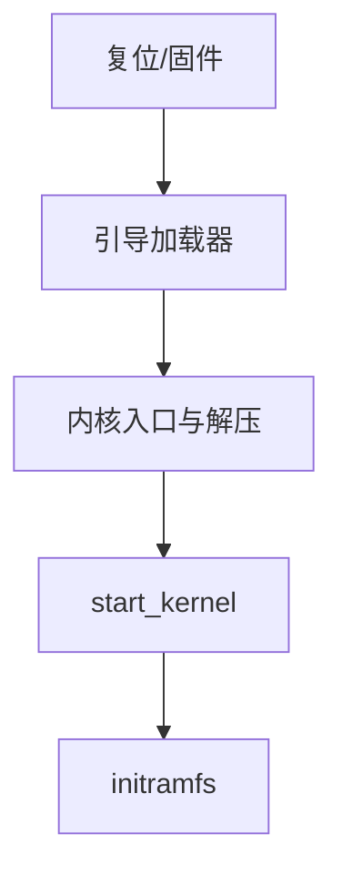

# 早期启动

复位后引导程序把内核装入内存并跳转；内核解压、建页表、初始化中断与分配器，直到能够挂上根并创建 pid 1。

<footer>—— 据 Tanenbaum MOS；Love；Bovet 对 Linux 启动链的整理</footer>

[上一课](/cs/sysfs-proc)假定内核已在跑。[内核与用户态](/cs/kernel-user) 说复位先进入内核。[buddy](/cs/buddy-allocator) 与中断向量都需要有人第一次建好。缺口是**早期启动链**：固件/引导加载器 → 内核入口 → 解压 → `start_kernel` 量级的初始化顺序。不把每家 SoC 的 bootrom 写成手册。

## 问题

CPU 复位时没有页表、没有驱动、没有 FS。引导加载器在实模式或固件环境读磁盘/网络，把内核映像放到约定物理地址，传递命令行与内存图。内核必须：开分页（[分页](/cs/paging-vm) 的第一套表）、识别内存、初始化 buddy、中断控制器、调度器、VFS 根。缺口是这条因果顺序，而不是某个启动徽标。

initramfs 是内存里的早期根，用于加载根设备模块再切到真根。设备树或 ACPI 描述板级硬件。本课合并这些，不当三篇。

## 方法

固件 → bootloader（如 GRUB、UEFI）→ 跳内核入口。入口：关干扰、建临时映射、解压缩。`start_kernel`：内存、调度、时间（jiffies 来源）、驱动子系统、挂载 initramfs、启动 pid 1 前的 rest_init。失败通常 panic，因为还没有用户空间可报错。命令行可指定 `root=`。

## 机制

早期启动把组成课的「上电」接到 OS 对象的第一次出现：没有 buddy 就没有后续缺页；没有中断就没有 DMA 完成。用户/内核分裂的第一套内核映射在这里建立。不要把安全启动密钥管理写成攻击或绕过指南；只承认引导路径可被验签。

## 边界

本课不引入 kexec 的全部协议。不保证嵌入式无 bootloader（有的直接进内核）。下一课：内核把 CPU 交给用户空间的 pid 1，由它挂真根、拉服务。

后课默认：内核已能调度并有早期根。用户空间的第一个进程，下一课 init。

## 小结

- 引导加载器装核；内核建页表与分配器后才能挂根。
- initramfs 解决「根设备驱动还不在根上」的环。
- pid 1 与真根是 init 课的缺口。
- 出处：Tanenbaum *MOS*；Love, *LKD*；Bovet and Cesati, *ULK*。
