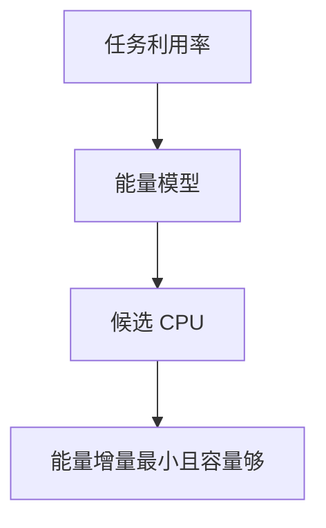

# 能耗感知调度 EAS

EAS 用能量模型估计「在哪颗核、哪个频率跑这个任务更省」，在满足容量的前提下偏向高效核。

<footer>—— 据 Linux Energy Aware Scheduling 文档；ARM 对 EM 能量模型的说明</footer>

[调度域](/cs/sched-domains) 只看负载与缓存。手机与服务器都要 **焦耳**。缺口是 EAS：把 [cpufreq](/cs/cpufreq-governor) 的频率与容量接入选核。异构核细节下一课。

## 问题

同样负载，小核低频可能更省，大核更快。能量模型：每 CPU 一组（频率，功耗，容量）。wakeup：在域里找能消化 util 且能量增量最小的 CPU。缺口：util 估计（PELT）误差；关 EAS 则退回只看 idle。本课不把 Android 的全部 vendor 补丁当主线。

EM 来自 DT/firmware。没有模型则 EAS 不启用。对象是选核，不是编译器优化。

## 方法

任务 util 更新 → wake → `find_energy_efficient_cpu` 扫候选。对照 BFQ：一个省磁盘延迟公平，一个省电。对照 [NAPI poll](/cs/io-polling)：poll 核不进 C-state，EAS 算出来也会「贵」。

## 机制

EAS 把功耗变成调度输入，使「永远大核」不再是默认。它依赖模型诚实与 util 稳定。不要写成气候课。与 memcg：内存不够会睡，util 下降，选核跟着变。

过激节能会伤尾延迟，故有容量余量。

实现上：没有 energy model 时 EAS 直接关闭。util 估计滞后会把任务放错核，表现为掉帧。EAS 与 schedutil 共用 PELT，改一边会影响另一边。 读法上只引用[上一课](/cs/sched-domains)的结论，不把对象换成训练推理或限价簿。

本课在操作系统进阶的「调度进阶 / 公平、实时与能耗」课序里，对象是 **能耗感知调度 EAS**。

- 先修只引用，不重导：上一课的结论当公理，本课只补差。
- 五栏不吞并：不把本课写成大模型训练/推理，也不写成限价簿或权重量化。
- 文献用 OSTEP、McKusick、内核文档与具名会议论文；不发明 arXiv 编号。

## 边界

本课不引入每个 governor 与 EAS 的交互矩阵——governor 后课。下一课把大小核拓扑钉死：异构调度。

版本字段会变，课序钉的是机制对象「能耗感知调度 EAS」，不是某一主线内核的结构体名。
后课默认：选核可最小化能量增量。大核小核如何分任务，下一课。

## 小结

- EAS 用能量模型在容量约束下选核。
- 依赖 PELT 与固件 EM。
- 异构核调度是下一课。
- 出处：Linux EAS；ARM energy model。
