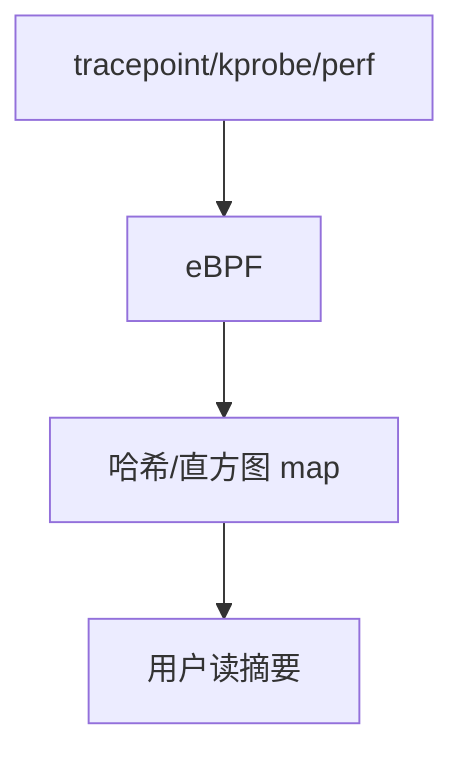

# eBPF 观测

观测用 BPF 挂在 tracepoint、kprobe、perf 事件上：在核内聚合进 map，用户只读摘要，避免每事件出核。

<footer>—— 据 Linux bpf(2)；BCC/bpftrace 实践；[XDP](/cs/xdp-ebpf) 为数据面对照</footer>

[perf](/cs/perf-sampling) 常把样本拷出核。[ftrace](/cs/ftrace-tracepoints) 环也会满。缺口是 **eBPF 观测**：在事件处聚合。不是网络过滤重讲。

## 问题

程序：读 `pt_regs`、pid、延迟，`map` 直方图。verifier 限制。缺口：CO-RE 可移植；与 [sched_ext](/cs/sched-ext) 同引擎不同挂钩。本课不把 bpftrace 语法当语言课。

生产观测应优先 tracepoint 再 kprobe。对象是可验证的内核小程序。

## 方法

加载 → attach → 事件触发 BPF → 更新 map → 用户轮询 map。对照 XDP：早丢包 vs 记直方图。对照 [audit](/cs/kernel-audit)：audit 要合规原文，BPF 常只要统计。对照 ASan：编译插桩 vs 运行时挂接。

## 机制

eBPF 把观测从「搬运原始事件」变成「核内折减」，使生产系统可常开。verifier 是安全边界。不要写成 AIOps。与 [memcg](/cs/memcg)：map 占内核内存，要限额。

错误 attach 高频繁点仍可打满 CPU。

实现上：CO-RE 靠 BTF 把字段偏移从编译时解开。map 大小计入内核内存，要 ulimit/memcg。attach 到高频 kprobe 仍能把 CPU 打满，优先 tracepoint。 读法上只引用[上一课](/cs/perf-sampling)的结论，不把对象换成训练推理或限价簿。

本课在操作系统进阶的「安全、启动与调试 / 观测与调试」课序里，对象是 **eBPF 观测**。

- 先修只引用，不重导：上一课的结论当公理，本课只补差。
- 五栏不吞并：不把本课写成大模型训练/推理，也不写成限价簿或权重量化。
- 文献用 OSTEP、McKusick、内核文档与具名会议论文；不发明 arXiv 编号。

## 边界

本课不引入所有 helper。不保证稳定 attach 点 ABI——后课 kABI。下一课崩溃转储：kdump。

版本字段会变，课序钉的是机制对象「eBPF 观测」，不是某一主线内核的结构体名。
后课默认：可在核内用 BPF 聚合事件。崩溃转储 kdump/crash，下一课。

## 小结

- 观测 BPF 在事件处聚合到 map。
- 比全量出核便宜；挂钩点选择决定税。
- kdump 是下一课。
- 出处：bpf(2)；BCC；内核 BPF 文档。
