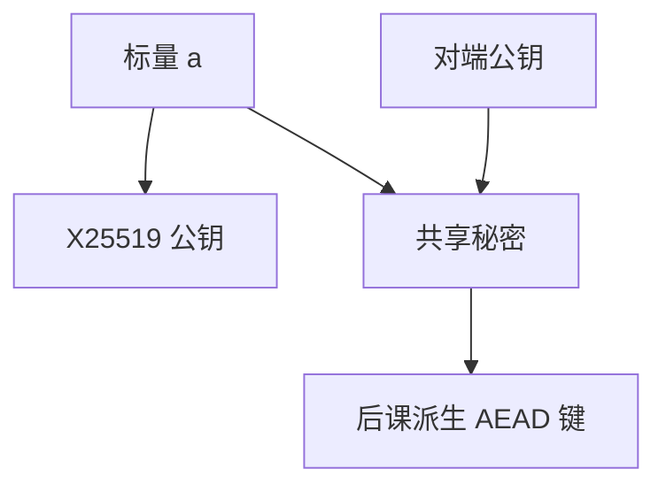

# ECDH 与 X25519

椭圆曲线 DH 用短得多的密钥达到与有限域 DH 同类的协商目标。X25519 把曲线、编码与钳位私钥收成一套难误用的合同，而不是「任意一条曲线都行」。

<footer>—— Koblitz / Miller 椭圆曲线公钥；Bernstein, Curve25519；RFC 7748</footer>

## 定位

上一课[RSA 攻击面](/cs/rsa-attacks)劝许多协议离开 RSA 封装。主干[椭圆曲线](/cs/elliptic-curve-group)已有群直觉。缺口是**ECDH 作为密钥协商**：共享秘密是点的坐标派生，不是加密消息。X25519 是工程默认之一。

后课默认已经读完本课钉下的合同，只补差，不从该领域第一性原理重开。

## 问题

有限域 DH 公钥大；ECDH 在合适曲线上密钥约 256 比特。小群、错误曲线、点不在曲线上，会把协商拉到弱群——本课只陈述必须校验或用蒙哥马利曲线避开一类检查。X25519：Curve25519、固定基、钳位。缺口是协商合同，不重推曲线方程。

### 共享秘密还要 KDF

ECDH 输出不是 AEAD 键。HKDF 更后；本课只要求「再派生」。

RFC 7748。TLS 1.3 的 x25519 是命名群。不要把任意自选曲线当同等安全。本课不给弱曲线参数的利用步骤。

## 方法

对照 DH：$g^a,g^b\mapsto g^{ab}$ 变成标量乘。陈述 X25519 的 32 字节编码。认证仍缺：无签名或预共享时，ECDH 对中间人成功。证书课已在主干；本进阶课后面信道单元再钉链验证细节。

图中节点是本课的机制骨架；课程不把图展开成可运行的攻击步骤。

## 机制

前向保密来自临时标量。长期静态 ECDH 没有同样的遗忘性。实现必须用恒定时间标量乘；曲线选择把一类无效点问题收进规格。身份绑定仍是 PKI 或预共享。

前提写进合同之后，游戏外的误用只当失败模式点名，不在本课写成操作程序。

## 边界

本课不写全部 NIST 曲线清单。下一课 ECDSA/EdDSA：同一类群上的签名，与 DH 分工，密钥不要混用语义。

## 小结

- RSA 封装之外，ECDH 做临时协商。
- X25519 是难误用的 Curve25519 合同。
- 输出必须再 KDF；无认证则中间人成功。
- 下一课：同群上的签名 EdDSA/ECDSA。
- 出处：RFC 7748；Bernstein, Curve25519；对照 Diffie and Hellman, 1976。
