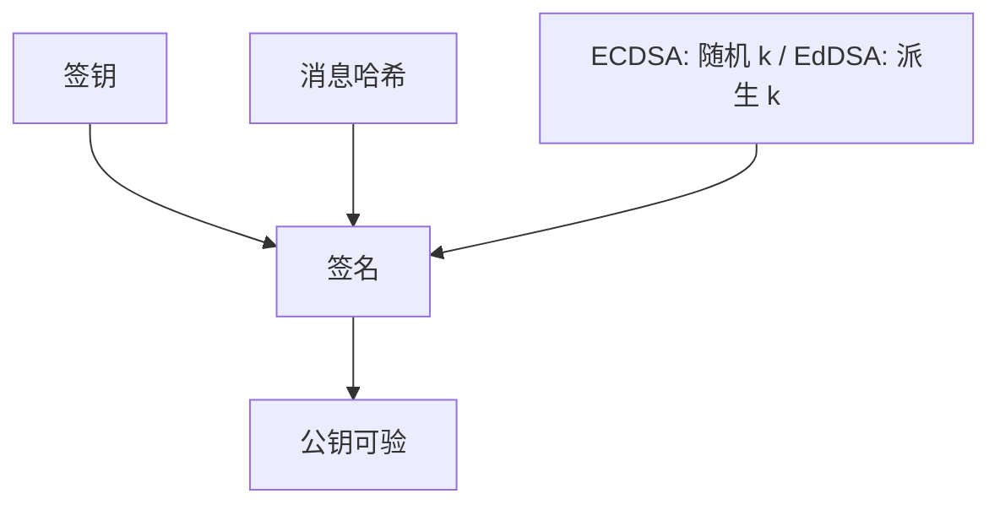

# ECDSA / EdDSA

曲线上的签名：ECDSA 沿用 DSA 的随机 $k$ 合同，$k$ 泄漏或复用即私钥泄漏；Ed25519 把 $k$ 从私钥与消息确定性派生，去掉这口坑。

<footer>—— Johnson, Menezes and Vanstone 对 ECDSA；Bernstein, Duif, Lange, Schwabe and Yang, Ed25519；RFC 8032</footer>

## 定位

上一课[ECDH 与 X25519](/cs/ecdh-x25519)用曲线做协商。缺口是**认证**：签名。主干[MAC 与签名](/cs/mac-signature)已分对称与非对称；本课落到曲线族与确定性。不重写证书链。

后课默认已经读完本课钉下的合同，只补差，不从该领域第一性原理重开。

## 问题

ECDSA 验证用公钥点；签名生成需要每次唯一且保密的 nonce $k$。Sony 一类事故是 $k$ 复用——本课只陈述「复用则线性方程出私钥」，不给求解步骤。EdDSA（Ed25519）：$k$ 由哈希确定，去掉 RNG 失败。缺口是签名合同与密钥分离（签钥 ≠ DH 钥）。

### 规范编码

点压缩与规范签名可防可塑。协议应验规范形式，避免同一逻辑消息多种编码。

RFC 8032。FIPS 186 含 ECDSA。阈值与硬件签名更后。本课不提供从两枚签名提取私钥的程序。

## 方法

对照：ECDSA 要好 RNG；Ed25519 确定性。消息先哈希。域分离：不同协议用不同上下文。指出 JWT 等后课若允许 `alg=none` 是协议误用，不是曲线的锅。

图中节点是本课的机制骨架；课程不把图展开成可运行的攻击步骤。

## 机制

签名服务不可否认与握手认证（证书里的公钥）。ECDH 服务保密密钥。两者都在曲线上，威胁模型不同：签钥泄漏是伪造，DH 长期钥泄漏在无前向保密时是解密历史。CSPRNG 下一课专收「$k$ 从哪来」。

前提写进合同之后，游戏外的误用只当失败模式点名，不在本课写成操作程序。

## 边界

本课不把双线性对和 BLS 插进主干。随机数生成器下一课：不仅服务 ECDSA，也服务 OAEP 种子与 nonce。

## 小结

- ECDH 协商；ECDSA/EdDSA 认证。
- ECDSA 的 $k$ 复用是规格级失败；Ed25519 确定性派生。
- 签钥与 DH 钥分离。
- 下一课 CSPRNG：种子与熵。
- 出处：RFC 8032；Johnson, Menezes and Vanstone；Bernstein et al., Ed25519。
