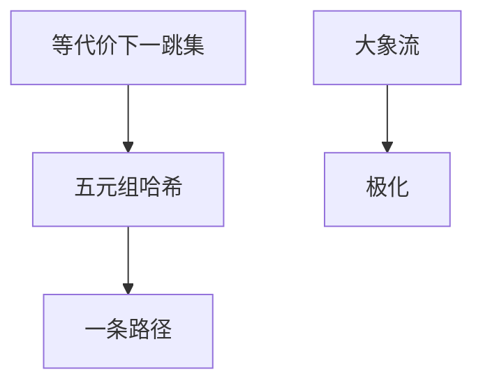

# ECMP 与哈希

等代价多路径把流用五元组哈希钉到一条下一跳，保序且分流；极化发生在少量大象流撞上同一条边时。

<footer>—— 据 RFC 2991 / 2992 多路径；RFC 6438 IPv6 流标签实践整理</footer>

[上一课](/cs/segment-routing) 的前缀 SID 仍走 ECMP。主干 OSPF 已点名等代价。[LACP](/cs/lacp) 在二层哈希。缺口是**三层哈希怎么键、为何不保带宽公平**。本课不把 VXLAN 封装写完。

## 问题

TE 可以钉路径；默认 IGP 给多条等代价下一跳。逐包喷洒会乱序，TCP 当成丢包。故按流哈希：同四元组（再加流标签）同路径。极化：哈希空间均匀不等于流量均匀——BDP 大的几条流可打满一条 100G，其它边空。重哈希（链路 up/down）会移动流，造成瞬时乱序。

不要把 ECMP 当成 WFQ：没有按流排队保证。

RFC 2991。数据中心后课 Clos 依赖大量 ECMP。本课不把具体 CRC 多项式当标准。

### 保序不保公平

按流哈希避免乱序；大象流极化。隧道要把熵透传到外层。重哈希会瞬时乱序。

## 方法

对照 LACP 键与 ECMP 键：一层 vs 三层，对象都是保序分流。画：候选下一跳集合 → 哈希 → 一条。对称性：正向与反向哈希不一致会导致不对称路径，排障痛苦，不是错误。

方法止于选定对象与对照；机制才说它如何嵌入已有分层与主干课。

## 机制

MPLS 可用熵标签把内层熵露给外层哈希，避免全网只按外层标签极化。VXLAN 后课同样要把内层端口映到 UDP 源端口。交换机 HOL：多条 ECMP 仍可能在某一跳汇聚到同一出端口。RPKI 与哈希无关。

随机化种子：不同设备用不同密钥防攻击者构造碰撞打满一条，是安全边注。

## 边界

本课不引入动态负载均衡（packet spraying with reordering repair）的全部。VXLAN 与覆盖网是下一课。后课默认：ECMP = 保序哈希，不保证流量公平。

不等代价分流（UCMP）按权重，仍是哈希，不是 TE 约束求解。

上一课留下的缺口在本课收口；「ECMP 与哈希」进入后课词汇表后只引用。文献用来钉对象与边界，不把本课写成该主题的独立综述。下一课[VXLAN 与覆盖网](/cs/vxlan-overlay)。

## 小结

- 按流哈希保序，按包喷洒乱序。
- 极化来自流大小，不是哈希偏置的唯一原因。
- 熵要透传到外层才能在隧道上 ECMP。
- 后课只引用本课钉死的对象，不从该领域总问题重开。
- 出处：RFC 2991；RFC 6438。
