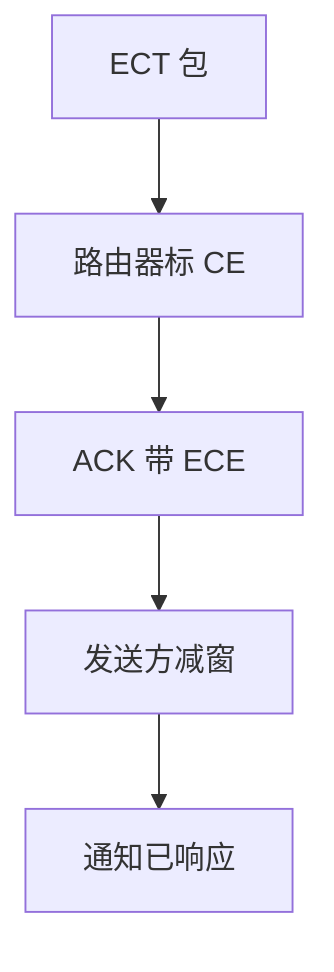

# ECN

路由器把 IP 头 CE 位置上，收端在 ACK 里回 ECE，发送方当拥塞处理而不必丢包；要两端与路径都同意。

<footer>—— 据 RFC 3168；RFC 8311；DCTCP 课对照整理</footer>

[AQM](/cs/aqm-red-codel) 可以丢也可以标。[DCTCP](/cs/dctcp) 已用 CE。[上一课](/cs/aqm-red-codel) 留下标记通道。缺口是 **RFC 3168 协商与语义**：ECT、CE、ECE、CWR。本课不把 bufferbloat 写完。

## 问题

丢包既是信号也是损伤。ECN：拥塞时标 CE，TCP 用 ECE 通知，发端减窗并回 CWR。握手用 ECN-Echo 与 CWR 位协商能力。中间盒把 CE 清零或丢 ECT 包，则静默失败。L4S 后用不同码点，本课点名。与 PFC：ECN 端到端（路径上最挤跳），PFC 一跳。

不要把 CE 当成应用错误码。

RFC 3168。Classic ECN 一次拥塞一窗口事件；DCTCP 用比例。本课钉经典语义再对照。

### 拥塞与丢包分离

CE 沿路径最挤跳；ECE/CWR 走 TCP。中间清洗则静默失败。Classic 一次一事件，DCTCP 用比例。

## 方法

画：ECT 发送 → AQM 标 CE → ECE → MD → CWR。对照无 ECN：丢 → 快重传。QUIC 也有 ECN 计数，后课。

方法止于选定对象与对照；机制才说它如何嵌入已有分层与主干课。

## 机制

ROCE/DCQCN 用 ECN 调速率，不是 TCP ECE。无线链路层丢包不是 CE，后课 TCP 无线会混。PMTUD 与 ECN 正交。安全：伪造 CE 可降速，需路径可信或统计。

部署：要主机栈、AQMs、不清洗的中间盒同时在。

## 边界

本课不引入 AccECN 的全部。缓冲膨胀是下一课。后课默认：ECN 把拥塞与丢包分离；协商失败则退回丢包信号。

只在交换机开标记、主机不开，等于没开。

上一课留下的缺口在本课收口；「ECN」进入后课词汇表后只引用。文献用来钉对象与边界，不把本课写成该主题的独立综述。下一课[缓冲膨胀](/cs/bufferbloat)。

## 小结

- CE 是路径拥塞信号，ECE/CWR 走 TCP。
- 需端到端支持，中间不可清洗。
- DCTCP 解释不同，码点可同。
- 后课只引用本课钉死的对象，不从该领域总问题重开。
- 出处：RFC 3168；RFC 8311。
