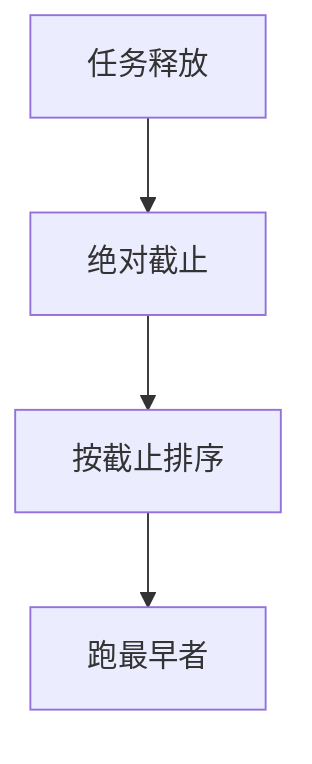

# EDF

总是跑当前绝对截止最早的任务；在同样的经典假设下，利用率不超过 1 则可调度，比速率单调更密。

<footer>—— 据 Liu and Layland, JACM 1973；Silberschatz et al. 对最早截止优先的整理</footer>

[上一课](/cs/rate-monotonic)用静态周期指定优先级，利用率界限约 0.69。缺口是**最早截止优先（EDF）**：优先级随绝对截止 $d_i$ 变，谁更紧急谁跑。Liu–Layland 下 $\sum C_i/P_i \le 1$ 即充分（且必要，对隐式截止）。本课钉这根动态尺子，不写 CBS 服务器。

## 问题

RM 可能拒绝一组其实能在单核上排下的任务，只因为静态优先级不够密。EDF 每次调度比较当前绝对截止，抢占发生在更早截止的任务释放时。缺口不是再讲周期任务模型，而是：**动态优先级换来更高利用率，换出入队时重排与过载行为不同**。

过载时 EDF 会让许多任务都稍微逾期；RM 往往让低优先级任务单独炸掉。哪一种更可接受是政策，不是定理。

## 方法

释放时计算 $d_i =$ 释放时刻 $+ D_i$（常 $D_i=P_i$）。runqueue 按 $d_i$ 排序。调度：队头即最早截止。利用率测试：和 $\le 1$。与 RM 一样忽略切换税除非打进 $C$。多核上全局 EDF 没有单核这么干净的界限，本课只钉单核。

Linux `SCHED_DEADLINE` 一类是直觉近亲，实现含运行时预算；主干不当成源码课。

## 机制

EDF 在经典假设下单核最优：能被某算法排下的，EDF 也能。它仍怕锁：反转会让「最早截止」空等。与 vruntime 对照：EDF 最小化逾期，不摊份额；后台编译若误进 EDF 会饿死分时任务，所以调度类要隔离。

实现成本：每个事件可能对数时间重排，而 RM 是固定槽。这是工程税，不是可调度性。

## 边界

本课不把多核可调度性的全部反例写完，不引入弱截止的 $m$-in-$k$。也不把网络包的 EDF 排队当成 CPU 调度。CPU 绑核如何限制 EDF/RM 的迁移，下一课。

后课默认：单核期限调度可用 RM 或 EDF。任务与中断还要能钉在某几颗核上，下一课讲 CPU 亲和。

## 小结

- EDF：跑当前最早绝对截止；单核利用率界限为 1。
- 过载形态与 RM 不同；锁仍能破坏期限。
- 绑核是下一课。
- 出处：Liu and Layland, *JACM* 1973；Silberschatz et al., *OSC*。
