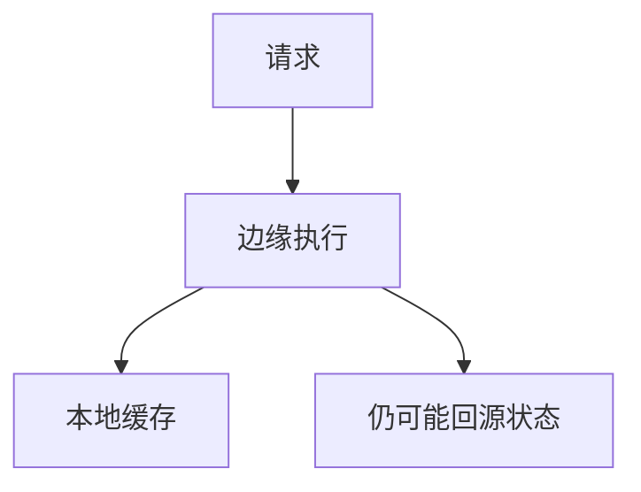

# 边缘计算

把函数或小服务放到 POP，减 RTT 与回源；状态与一致性比缓存对象难，失败域跟着边缘走。

<footer>—— 据 CDN 边缘函数实践；RFC 9110 对照；主干任播课整理</footer>

[上一课](/cs/cdn-cache-hierarchy) 缓存的是表示。缺口是**在边缘跑逻辑**：A/B、鉴权、改写、小 API。本课不把 L4/L7 LB 写完。

## 问题

缓存解决 GET 不变对象。个性化、Bot 校验、聚合要计算。边缘函数：请求到达 POP 即执行，近用户，冷启动与隔离是代价。状态：会话若在中心 DB，边缘仍要回源，延迟优势缩水。与 5G 边缘 MEC 同类动机，一层 Web，一层 RAN。不是把数据中心 Clos 搬到每座城。

不要把边缘写成「无限小云」。

各家 Workers 是实现。本课钉位置与状态边界。

### 算得近仍怕状态

无状态函数最赚 RTT。会话在中心 DB 则优势缩水。失败域随 POP。不是每城一座 Clos。

## 方法

对照：纯缓存 / 边缘函数 / 中心源。画：DNS → POP 计算 → 可选源。与 PTP：边缘时间仍靠 NTP 够用。

方法止于选定对象与对照；机制才说它如何嵌入已有分层与主干课。

## 机制

GeoDNS/任播决定哪个 POP。Cookie 会话粘到 POP 或用全局存储。QUIC CID 要在任播集群可路由。gRPC 在边缘要终止 H2。失败：某 POP 代码坏只伤一区域，但版本发布要全网。

安全：多租隔离，不写逃逸。

## 边界

本课不引入 wasm 运行时的全部。L4/L7 负载均衡是下一课。后课默认：边缘计算换 RTT，状态仍是难题。

把强一致账本放边缘会变成分布式事务课，不在本课展开。

上一课留下的缺口在本课收口；「边缘计算」进入后课词汇表后只引用。文献用来钉对象与边界，不把本课写成该主题的独立综述。下一课[L4 / L7 负载均衡](/cs/l4-l7-load-balancing)。

## 小结

- 计算随请求到 POP，减 RTT。
- 无状态最赚；有状态易回源。
- 与缓存层次互补。
- 后课只引用本课钉死的对象，不从该领域总问题重开。
- 出处：边缘函数实践；HTTP 语义对照。
