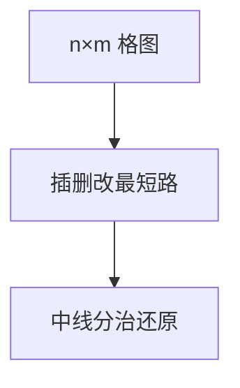

# 编辑距离与 Hirschberg

Levenshtein 距离是插、删、改的格图最短路；$O(nm)$ 时间，Hirschberg 用分治把空间降到线性并还原路径。

<footer>—— 据 Levenshtein, 1966；Hirschberg, A Linear Space Algorithm for Computing Maximal Common Subsequences, 1975；CLRS 第 15 章整理</footer>

上一课[LIS 与 LCS](/cs/lis-lcs)给了 LCS 表。编辑距离：对角匹配代价 0，水平/垂直插删 1，对角替换 1（或另设）。缺口是同一格图的最短路，以及 Hirschberg：两边 DP 在中线相遇，递归还原，空间 $O(n+m)$。不重写 LCS 转移形状。后课序列比对与位并行。

## 问题

$dp[i][j]=\min(dp[i-1][j]+1,dp[i][j-1]+1,dp[i-1][j-1]+[a_i\neq b_j])$。LCS 长度 $k$ 时，若只插删，距离 $n+m-2k$。只要距离：滚动两行 $O(\min(n,m))$ 空间。要操作序列：朴素 $O(nm)$ 空间存前驱。Hirschberg：对中行分别正反 DP，找分割点使两侧距离和最小，递归。

缺口是空间，不是新的编辑操作。

### 不是近似匹配通配符课

通配、仿射缺口罚分（Gotoh）后课点名。本课单位代价 Levenshtein。不要把 KMP 当编辑距离。

Levenshtein 1966。Hirschberg 1975 原为 LCS，编辑距离同构。后课 Myers 位并行、$O(nd)$ 差分。

## 方法

先写标准 DP。只要长度用滚动。要路径用 Hirschberg 或存前驱。对角线优先可提前停（阈值）。

边界：空串对长度为对方长度。

## 机制

格图 DAG，边权 0/1，DP 即 DAG 最短路。Hirschberg：最优路径必过中线某点，该点最小化左半+右半。与分治优化不同：这里分治的是路径空间不是决策单调。

## 边界

本课不写 DNA 仿射缺口全文。不写块编辑。后课默认：编辑距离 $O(nm)$；线性空间还原用 Hirschberg。下一课比对与位并行。

## 小结

- 编辑距离 = 格图最短路 $O(nm)$。
- Hirschberg 线性空间还原路径。
- 与 LCS 同一张格，代价不同。
- 出处：Levenshtein, 1966；Hirschberg, 1975。
